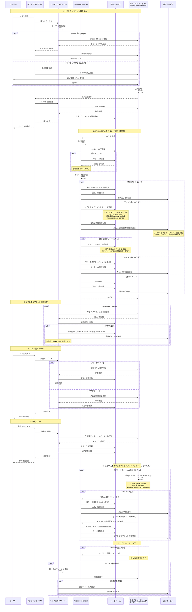

```mermaid
sequenceDiagram
    participant User as ユーザー
    participant App as クライアントアプリ
    participant Backend as バックエンドサーバー
    participant Webhook as Webhook Handler
    participant DB as データベース
    participant Platform as 課金プラットフォーム<br/>(Stripe/Apple/Google)
    participant Notification as 通知サービス

    Note over User, Platform: 1. サブスクリプション購入フロー

    User->>App: プラン選択
    App->>Backend: 購入リクエスト
    Backend->>Backend: ユーザー認証確認

    alt Webの場合 (Stripe)
        Backend->>Platform: Checkout Session作成
        Platform-->>Backend: セッションURL返却
        Backend-->>App: リダイレクトURL
        App->>Platform: 決済画面表示
        User->>Platform: 決済情報入力
    else ネイティブアプリの場合
        Backend-->>App: 商品情報返却
        App->>Platform: アプリ内購入開始
        Platform->>User: 認証要求（Face ID等）
        User->>Platform: 認証完了
    end

    Platform->>Platform: 決済処理
    Platform-->>App: 購入完了通知
    App->>Backend: レシート検証要求
    Backend->>Platform: レシート検証API
    Platform-->>Backend: 検証結果
    Backend->>DB: サブスクリプション情報保存
    Backend-->>App: 購入完了
    App-->>User: サービス有効化

    Note over Webhook, Platform: 2. Webhookによるイベント処理（非同期）

    Platform->>Webhook: イベント送信
    Webhook->>Webhook: 署名検証
    Webhook->>DB: イベントログ保存

    alt 重複チェック
        Webhook->>DB: イベントID確認
        DB-->>Webhook: 処理済み判定
        Note over Webhook: 処理済みならスキップ
    end

    Webhook->>Webhook: イベント種別判定

    alt 更新成功イベント
        Webhook->>DB: サブスクリプション期限更新
        Webhook->>DB: 支払い履歴記録
        Webhook->>Notification: 更新完了通知送信
    else 支払い失敗イベント
        Webhook->>DB: サブスクリプションステータス更新
        Note over DB: プラットフォームの状態に対応<br/>Stripe: past_due<br/>iOS: billing_retry_period<br/>Android: grace_period
        Webhook->>DB: 支払い失敗履歴記録
        Webhook->>Notification: 支払い方法更新依頼通知送信
        Note over Notification: リトライはプラットフォーム側が実施<br/>ユーザには支払い方法の更新を促す
        alt 猶予期間ポリシーによる
            Webhook->>DB: サービスアクセス継続設定
            Note over DB: 猶予期間中はアクセス維持<br/>（ポリシーに応じて即時停止も可能）
        end
    else キャンセルイベント
        Webhook->>DB: ステータス更新（キャンセル済み）
        Webhook->>DB: キャンセル日時記録
        Webhook->>Notification: キャンセル確認通知
    else 返金イベント
        Webhook->>DB: 返金記録
        Webhook->>DB: サービス無効化
        Webhook->>Notification: 返金完了通知
    end

    Webhook-->>Platform: 200 OK

    Note over User, Backend: 3. サブスクリプション状態同期

    loop 定期同期（Daily）
        Backend->>Platform: サブスクリプション状態取得
        Platform-->>Backend: 最新状態返却
        Backend->>DB: 状態比較・更新
        alt 不整合検出
            Backend->>DB: 修正処理（プラットフォームの状態を正とする）
            Backend->>Notification: 管理者アラート送信
            Note over Backend: 不整合の内容と修正内容を記録
        end
    end

    Note over User, Backend: 4. プラン変更フロー

    User->>App: プラン変更要求
    App->>Backend: 変更リクエスト

    alt アップグレード
        Backend->>Platform: 即時プラン変更API
        Platform-->>Backend: 変更確認
        Backend->>DB: プラン情報更新
        Backend->>Backend: 差額計算
    else ダウングレード
        Backend->>Platform: 次回更新時変更予約
        Platform-->>Backend: 予約確認
        Backend->>DB: 変更予定保存
    end

    Backend-->>App: 変更完了
    App-->>User: 確認画面表示

    Note over User, Backend: 5. 解約フロー

    User->>App: 解約リクエスト
    App->>Backend: 解約処理要求
    Backend->>Platform: サブスクリプションキャンセルAPI
    Platform-->>Backend: キャンセル確認
    Backend->>DB: ステータス更新
    Backend->>DB: 解約理由記録
    Backend-->>App: 解約完了
    App-->>User: 解約確認画面

    Note over Platform, DB: 6. 支払い失敗後の自動リトライフロー（プラットフォーム側）

    loop プラットフォームの自動リトライ
        Platform->>Platform: 最適なタイミングでリトライ実行
        Note over Platform: Stripe: Smart Retries<br/>iOS: 最大60日間<br/>Android: Grace→Account Hold

        alt リトライ成功
            Platform->>Webhook: 支払い成功イベント送信
            Webhook->>DB: ステータス更新（active/有効）
            Webhook->>DB: 支払い履歴記録
            Webhook->>Notification: 支払い再開通知
        else リトライ期間終了・失敗確定
            Platform->>Webhook: キャンセル/期限切れイベント送信
            Webhook->>DB: ステータス更新（canceled/expired）
            Webhook->>DB: サービス無効化
            Webhook->>Notification: サブスクリプション停止通知
        end
    end

    Note over Platform, DB: 7. エラーハンドリング

    alt Webhook受信失敗
        Platform->>Webhook: リトライ（指数バックオフ）
        Note over Platform: 最大24時間リトライ
    end

    alt レシート検証失敗
        Backend->>Backend: ローカルキャッシュ確認
        Backend->>Platform: 再検証試行
        alt 再検証も失敗
            Backend->>DB: 保留ステータス設定
            Backend->>Notification: 管理者アラート
        end
    end
```
