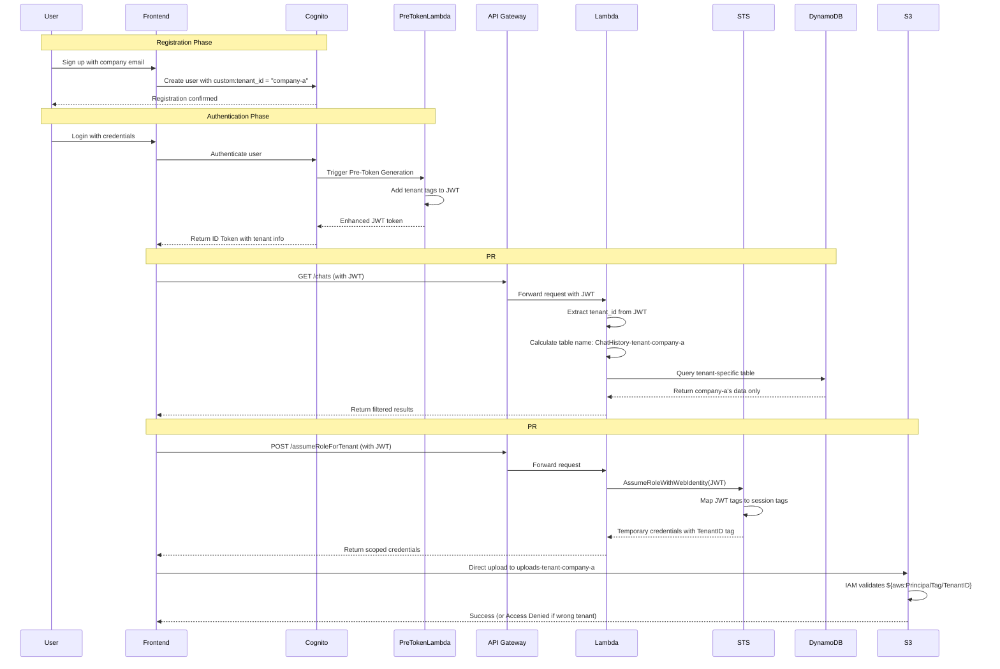

# Tenant Resource Access Flow Diagram

## Complete Flow: User Registration to Resource Access



## Simplified View: Two Access Patterns

### Pattern 1: Application-Managed (PR#16)
```
User → API → Lambda → [Tenant Logic] → DynamoDB/S3
                            ↓
                  Selects correct tenant table
```

### Pattern 2: IAM-Managed (PR#15)
```
User → Get Credentials → Direct AWS Access
           ↓                      ↓
      STS with Tags        IAM enforces tenant
```

## Key Components

### 1. JWT Token Structure
```json
{
  "sub": "user-uuid",
  "email": "john@company-a.com",
  "custom:tenant_id": "company-a",
  "https://aws.amazon.com/tags": {
    "principal_tags": {
      "TenantID": ["company-a"]
    }
  }
}
```

### 2. Resource Naming
```
Base Resource: ChatHistory
Tenant Resource: ChatHistory-tenant-company-a

Base Bucket: uploads
Tenant Bucket: uploads-tenant-company-a
```

### 3. Access Control

**Application Level (PR#16):**
```typescript
// In every Lambda function
const tenantId = getTenantId(event);
const tableName = `${baseTable}-tenant-${tenantId}`;
// Only accesses tenant-specific table
```

**IAM Level (PR#15):**
```json
{
  "Resource": "arn:aws:s3:::*-tenant-${aws:PrincipalTag/TenantID}/*"
  // Automatically restricts to tenant's bucket
}
```

## Security Comparison

| Aspect | PR#15 (IAM) | PR#16 (App) |
|--------|--------------|-------------|
| Enforcement | AWS IAM | Lambda Code |
| Performance | Slower (STS) | Faster |
| Audit Trail | CloudTrail | CloudWatch |
| Direct Access | Yes | No |
| Code Complexity | Higher | Lower |
| Security Level | Maximum | Good |

## When to Use Each

**Use PR#15 (IAM/STS) for:**
- File uploads/downloads
- Bulk operations
- Third-party integrations
- Maximum security requirements

**Use PR#16 (Application) for:**
- Real-time chat operations
- Frequent API calls
- Existing API compatibility
- Better performance needs