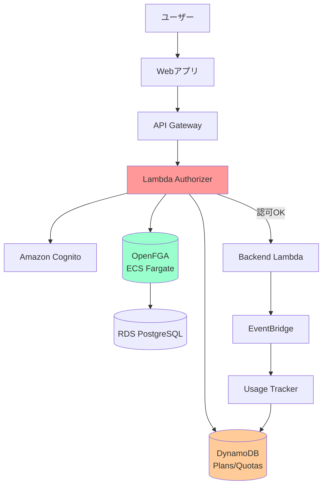
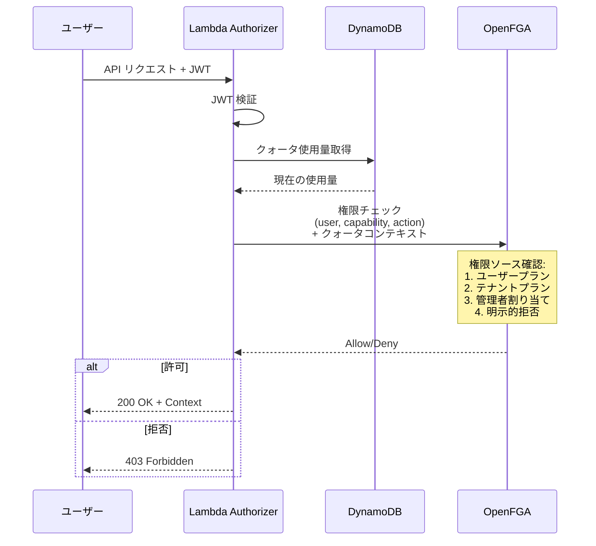

# OpenFGA 認可システム - 完全ガイド

**バージョン:** 1.1
**最終更新:** 2025-10-22
**ステータス:** 本番対応済み

この包括的なガイドでは、OpenFGAベースの認可システムの全体像、アーキテクチャ、実装、デプロイ、API リファレンス、運用手順について説明します。

## 目次

1. [概要](#概要)
2. [デプロイメントモデル](#デプロイメントモデル)
3. [クイックスタート](#クイックスタート)
4. [アーキテクチャとビジネスモデル](#アーキテクチャとビジネスモデル)
5. [CDK実装とデプロイメント](#cdk実装とデプロイメント)
6. [ストアとスキーマのセットアップ](#ストアとスキーマのセットアップ)
7. [API リファレンス](#api-リファレンス)
8. [システム更新手順](#システム更新手順)
9. [トラブルシューティング](#トラブルシューティング)
10. [モニタリング](#モニタリング)

---

## 概要

OpenFGA 認可システムは、ハイブリッド ToC (To Consumer) / ToB (To Business) ビジネスモデルをサポートする、本番対応のスケーラブルな認可サービスです。2つのデプロイメントオプションを提供します：スタンドアロンスタック（従来型、依然サポート）とテナントスタック統合（新推奨）。

### 主な特徴

- **ハイブリッドビジネスモデル** - ToC（個人向け）とToB（法人向け）の両方をサポート
- **Entitlementベースの権限管理** - 柔軟な権限割り当てと継承
- **2段階クォータ管理** - テナント全体プール + 個別ユーザー制限
- **明示的拒否** - 管理者による特定機能のブロック
- **リソースレベル制御** - Conversation/Document の所有権と共有管理

### 技術スタック

- **OpenFGA v1.5.0+** - Zanzibar ベースの認可エンジン
- **ECS Fargate** - サーバーレスコンテナプラットフォーム
- **RDS PostgreSQL 15.4** - リレーションシップストレージ
- **AWS Lambda** - Authorizer 関数
- **DynamoDB** - プラン定義とクォータ追跡
- **Application Load Balancer** - HTTP (8080) と gRPC (8081) エンドポイント

### コスト見積もり

#### オプション A: スタンドアロンデプロイメント
- ECS Fargate (3-5 タスク × 0.5 vCPU): $54-90/月
- RDS db.t4g.small (Multi-AZ): $60/月
- ALB: $16/月
- **合計: 月額 ~$130-166**

#### オプション B: テナント統合デプロイメント（推奨）
- テナント当たり月額 ~$87
- スタンドアロンと比較して約30%のコスト削減
- VPCとNAT Gatewayの重複を排除

**SpiceDB+EKSからの削減: 70-75%**

---

## デプロイメントモデル

認可システムは2つの構成でデプロイできます：

### オプション A: スタンドアロンスタック（従来型）

**概要：** 専用のVPCとインフラストラクチャで独立してデプロイします。

**設定ファイル：** `cdk.authorization.json`

**利点：**
- 完全な独立性と障害分離
- 独立したスケーリングとアップグレード
- より強固なセキュリティ境界
- 本番環境とマルチテナント環境に推奨

**コスト：** 月額 ~$130-166/スタック

**デプロイコマンド：** `npm run cdk:authz:deploy`

### オプション B: テナントスタック統合（新推奨）

**概要：** 各テナントのVPC内に認可システムを統合してデプロイします。

**設定ファイル：** `cdk.tenant.json` の `authorizationConfig`

**利点：**
- 約30%のコスト削減（重複インフラストラクチャの排除）
- 簡素化されたネットワーク（VPCピアリング不要）
- 低レイテンシー（同一VPC通信）
- リソース利用の向上
- 単一コマンドデプロイメント

**コスト：** テナント当たり月額 ~$87

**デプロイコマンド：** `npm run cdk:tenant:deploy`

### デプロイメントオプション比較

| 側面 | スタンドアロンスタック | テナント統合 |
|------|---------------------|-------------|
| **デプロイメント** | 独立したスタック | テナントスタックに統合 |
| **VPC** | 専用VPCまたは分離 | テナントと共有 |
| **コスト** | $130-166/月 | $87/月（30%削減） |
| **ネットワーク** | VPCピアリングが必要 | 同一VPC |
| **レイテンシー** | やや高い | 低い |
| **障害影響** | 分離 | テナント全体に影響 |
| **推奨用途** | 本番環境/大規模 | 開発/中小規模 |

---

## クイックスタート

このセクションでは、両方のデプロイメントオプションのセットアップ手順を説明します。

### 前提条件

- AWS CLI 設定済み
- CDK CLI インストール済み (`npm install -g aws-cdk`)
- OpenFGA CLI インストール済み (`brew install openfga/tap/fga`)

### オプション A: スタンドアロンデプロイメント

#### ステップ 1: 設定のセットアップ

```bash
cd packages/cdk
cp cdk.authorization.example.json cdk.authorization.json
```

`cdk.authorization.json` を編集（最小限の設定）:

```json
{
  "context": {
    "environment": "prod"
  }
}
```

#### ステップ 2: デプロイ

```bash
npm run cdk:authz:deploy
```

#### ステップ 3: 出力の取得

```bash
# OpenFGA エンドポイントを取得
aws cloudformation describe-stacks \
  --stack-name AuthorizationStackprod \
  --query 'Stacks[0].Outputs[?OutputKey==`OpenFgaEndpoint`].OutputValue' \
  --output text

# Lambda Authorizer ARN を取得
aws cloudformation describe-stacks \
  --stack-name AuthorizationStackprod \
  --query 'Stacks[0].Outputs[?OutputKey==`AuthorizerFunctionArn`].OutputValue' \
  --output text
```

### オプション B: テナント統合デプロイメント（推奨）

#### ステップ 1: テナント設定のセットアップ

```bash
cd packages/cdk
cp cdk.tenant.example.json cdk.tenant.json
```

`cdk.tenant.json` を編集し、`authorizationConfig` を追加:

```json
{
  "context": {
    "tenantId": "tenant-001",
    "environment": "dev",
    "controlPlane": {
      "userPoolId": "us-east-1_XXXXXXXXX",
      "userPoolClientId": "xxxxxxxxxxxxxxxxxxxxxxxxxx"
    },
    "authorizationConfig": {
      "enabled": true,
      "enableCache": true,
      "cacheTTLSeconds": 300,
      "enablePlayground": false,
      "openFgaImageTag": "v1.5.0",
      "multiAz": false,
      "deletionProtection": true
    }
  }
}
```

#### ステップ 2: テナントスタック全体をデプロイ

```bash
npm run cdk:tenant:deploy
```

このコマンドは、認可システムを含むすべてのテナントインフラストラクチャをデプロイします。

#### ステップ 3: 出力の取得

```bash
# OpenFGA エンドポイントを取得
aws cloudformation describe-stacks \
  --stack-name TenantAuthorizationStackdev-tenant-001 \
  --query 'Stacks[0].Outputs[?OutputKey==`OpenFgaEndpoint`].OutputValue' \
  --output text

# Lambda Authorizer ARN を取得
aws cloudformation describe-stacks \
  --stack-name TenantAuthorizationStackdev-tenant-001 \
  --query 'Stacks[0].Outputs[?OutputKey==`AuthorizerFunctionArn`].OutputValue' \
  --output text
```

### 設定オプション（テナント統合）

| オプション | 型 | デフォルト | 説明 |
|-----------|-----|-----------|------|
| `enabled` | boolean | `true` | 認可スタックデプロイメントの有効/無効 |
| `enableCache` | boolean | `true` | Lambda Authorizer レスポンスキャッシュを有効化 |
| `cacheTTLSeconds` | number | `300` | キャッシュTTL（秒単位、5分） |
| `enablePlayground` | boolean | `false` | OpenFGA playground を有効化（開発用のみ） |
| `openFgaImageTag` | string | `"latest"` | OpenFGA コンテナイメージタグ |
| `multiAz` | boolean | `false` | Multi-AZ RDS デプロイメントを有効化（本番推奨） |
| `deletionProtection` | boolean | `true` | RDS 削除保護を有効化 |

### 利用可能なコマンド

#### スタンドアロンデプロイメント用

| コマンド | 説明 |
|---------|-------------|
| `npm run cdk:authz:deploy` | 認可スタックをデプロイ |
| `npm run cdk:authz:synth` | CloudFormation テンプレートを合成 |
| `npm run cdk:authz:diff` | 差分を表示 |
| `npm run cdk:authz:list` | スタックをリスト表示 |
| `npm run cdk:authz:destroy` | スタックを削除 |

#### テナント統合デプロイメント用

| コマンド | 説明 |
|---------|-------------|
| `npm run cdk:tenant:deploy` | テナントスタック（認可含む）をデプロイ |
| `npm run cdk:tenant:synth` | CloudFormation テンプレートを合成 |
| `npm run cdk:tenant:diff` | 差分を表示 |
| `npm run cdk:tenant:list` | スタックをリスト表示 |
| `npm run cdk:tenant:destroy` | スタックを削除 |

### 設定プリセット

#### スタンドアロン - 開発環境（最小コスト）

```json
{
  "context": {
    "environment": "dev",
    "vpcConfig": {
      "createNew": true,
      "maxAzs": 1,
      "natGateways": 1
    },
    "openFgaConfig": {
      "desiredCount": 1,
      "minCapacity": 1,
      "enablePlayground": true
    },
    "databaseConfig": {
      "instanceType": "db.t4g.micro",
      "multiAz": false,
      "deletionProtection": false
    }
  }
}
```

**コスト**: 月額 ~$30-50

#### スタンドアロン - 本番環境（高可用性）

```json
{
  "context": {
    "environment": "prod",
    "vpcConfig": {
      "createNew": true,
      "maxAzs": 2,
      "natGateways": 2
    },
    "openFgaConfig": {
      "imageTag": "v1.5.0",
      "desiredCount": 2,
      "minCapacity": 2,
      "maxCapacity": 10
    },
    "databaseConfig": {
      "instanceType": "db.t4g.small",
      "multiAz": true,
      "deletionProtection": true,
      "backupRetentionDays": 14
    }
  }
}
```

**コスト**: 月額 ~$150-200

#### テナント統合 - 開発環境

```json
{
  "context": {
    "tenantId": "tenant-001",
    "environment": "dev",
    "authorizationConfig": {
      "enabled": true,
      "enableCache": false,
      "enablePlayground": true,
      "multiAz": false,
      "deletionProtection": false
    }
  }
}
```

**コスト**: テナント当たり月額 ~$70-90

#### テナント統合 - 本番環境

```json
{
  "context": {
    "tenantId": "tenant-001",
    "environment": "prod",
    "authorizationConfig": {
      "enabled": true,
      "enableCache": true,
      "cacheTTLSeconds": 300,
      "enablePlayground": false,
      "openFgaImageTag": "v1.5.0",
      "multiAz": true,
      "deletionProtection": true
    }
  }
}
```

**コスト**: テナント当たり月額 ~$120-150

---

## アーキテクチャとビジネスモデル

### システム全体構成図



### コンポーネント

**VPC（オプション）**
- 新規VPCの作成または既存VPCの使用が可能
- RDSとECS用のプライベートサブネット
- アウトバウンド接続用のNAT Gateway

**OpenFGA データベース**
- RDS PostgreSQL インスタンス
- 認可ポリシーとリレーションシップタプルを保存
- 自動バックアップと暗号化
- Multi-AZ サポート（高可用性）

**OpenFGA サービス**
- ECS Fargate デプロイメント
- Application Load Balancer（内部）
- オートスケーリング（2-10タスク）
- CloudWatch ログとメトリクス

**Lambda Authorizer**
- API Gateway 認可
- Cognito による JWT 検証
- OpenFGA 経由の権限チェック
- パフォーマンス向上のためのキャッシング

**Cognito User Pool（オプション）**
- 新規作成または既存のインポートが可能
- ユーザー認証とJWT発行

### ビジネスモデル対応

#### ToC (To Consumer) モデル
- 個人ユーザーが直接プランに登録
- テナント所属なしでも利用可能（無料ティア）
- ユーザー自身のプラン権限で機能アクセス

#### ToB (To Business) モデル
- テナント（組織）がプランに登録
- テナント管理者が個別ユーザーに権限付与
- テナントプラン + 管理者割り当ての組み合わせ

#### ハイブリッドモデル
- ユーザーが個人プラン**かつ**テナント所属
- **加算的統合** - どちらかのソースが許可すればアクセス可能
- テナント管理者による明示的拒否でオーバーライド可能

### 権限解決フロー



---

## CDK実装とデプロイメント

### 設定パラメータ

#### 一般設定

- **environment**（必須）: 環境名（例: `dev`, `staging`, `prod`）
- **deploymentId**（オプション）: 同じアカウント内の複数デプロイメント用の一意識別子（デフォルト: `default`）

#### VPC設定（`vpcConfig`）

- **createNew** (boolean): 新規VPCを作成するか既存VPCを使用するか
- **vpcId** (string): インポートするVPC ID（`createNew: false`の場合に必須）
- **vpcCidr** (string): 新規VPCのCIDRブロック（デフォルト: `10.1.0.0/16`）
- **maxAzs** (number): 最大アベイラビリティゾーン数（デフォルト: `2`）
- **natGateways** (number): NAT Gatewayの数（デフォルト: `1`）

#### OpenFGA設定（`openFgaConfig`）

- **imageTag** (string): OpenFGAコンテナイメージバージョン（デフォルト: `latest`）
- **cpu** (number): Fargateタスクのcpuユニット（デフォルト: `512`）
- **memoryLimitMiB** (number): メモリMB単位（デフォルト: `1024`）
- **desiredCount** (number): 希望タスク数（デフォルト: `2`）
- **minCapacity** (number): オートスケーリングの最小タスク数（デフォルト: `2`）
- **maxCapacity** (number): オートスケーリングの最大タスク数（デフォルト: `10`）
- **enablePlayground** (boolean): OpenFGA playground UIを有効化（デフォルト: `false`）

#### データベース設定（`databaseConfig`）

- **instanceType** (string): RDSインスタンスタイプ（デフォルト: `db.t4g.micro`）
- **multiAz** (boolean): Multi-AZデプロイメントを有効化（デフォルト: `false`）
- **allocatedStorageGb** (number): ストレージGB単位（デフォルト: `20`）
- **backupRetentionDays** (number): バックアップ保持期間（デフォルト: `7`）
- **deletionProtection** (boolean): 削除保護を有効化（デフォルト: `false`）

### デプロイメント手順

#### 標準デプロイメント

```bash
cd packages/cdk

# CloudFormation テンプレートを合成
npm run cdk:authz:synth

# 変更を確認
npm run cdk:authz:diff

# デプロイ
npm run cdk:authz:deploy
```

#### コンテキストオーバーライドでのデプロイメント

```bash
# 別の環境にデプロイ
npm run cdk:authz:deploy -- --context environment=staging

# 複数のオーバーライド
npm run cdk:authz:deploy -- \
  --context environment=prod \
  --context deploymentId=main \
  --context "databaseConfig.multiAz=true"
```

#### 特定のAWSアカウント/リージョンへのデプロイ

```bash
# AWS認証情報を設定
export AWS_PROFILE=authorization-account

# リージョンを設定
export CDK_DEFAULT_REGION=us-west-2

# デプロイ
npm run cdk:authz:deploy
```

### デプロイメントシナリオ

#### シナリオ1: スタンドアロン認可アカウント

専用のAWSアカウントに認可システムをデプロイ:

```json
{
  "context": {
    "environment": "prod",
    "vpcConfig": {
      "createNew": true,
      "vpcCidr": "10.1.0.0/16"
    },
    "databaseConfig": {
      "multiAz": true,
      "deletionProtection": true
    }
  }
}
```

```bash
export AWS_PROFILE=authz-account
npm run cdk:authz:deploy
```

#### シナリオ2: 既存VPCを使用

```json
{
  "context": {
    "environment": "prod",
    "vpcConfig": {
      "createNew": false,
      "vpcId": "vpc-abc123def"
    }
  }
}
```

#### シナリオ3: 開発環境

```json
{
  "context": {
    "environment": "dev",
    "vpcConfig": {
      "createNew": true,
      "natGateways": 1,
      "maxAzs": 1
    },
    "openFgaConfig": {
      "desiredCount": 1,
      "minCapacity": 1,
      "enablePlayground": true
    },
    "databaseConfig": {
      "instanceType": "db.t4g.micro",
      "multiAz": false,
      "deletionProtection": false
    }
  }
}
```

### スタック出力

デプロイ後、以下の出力が利用可能です:

| 出力 | 説明 | エクスポート名 |
|--------|-------------|-------------|
| VpcId | VPC ID | `authz-{env}-{id}-vpc-id` |
| UserPoolId | Cognito User Pool ID | `authz-{env}-{id}-user-pool-id` |
| OpenFgaEndpoint | OpenFGA HTTPエンドポイント | `authz-{env}-{id}-openfga-endpoint` |
| OpenFgaSecretArn | 事前共有キーシークレットARN | `authz-{env}-{id}-openfga-secret-arn` |
| DatabaseEndpoint | PostgreSQLエンドポイント | `authz-{env}-{id}-db-endpoint` |
| DatabaseSecretArn | DB認証情報シークレットARN | `authz-{env}-{id}-db-secret-arn` |
| AuthorizerFunctionArn | Lambda Authorizer ARN | `authz-{env}-{id}-authorizer-arn` |

---

## ストアとスキーマのセットアップ

### ストアの作成

```bash
# OpenFGA CLI をインストール
brew install openfga/tap/fga

# ストア作成
fga store create --name "production" \
  --api-url http://your-alb-endpoint:8080

# Store ID を環境変数に保存
export OPENFGA_STORE_ID="01HQXYZ123456789ABCDEF"
```

### スキーマの適用

```bash
# スキーマファイルの場所
cd packages/cdk/lib/construct/openfga

# スキーマをアップロード
fga model write \
  --store-id $OPENFGA_STORE_ID \
  --file authorization-schema.fga \
  --api-url http://your-alb-endpoint:8080

# モデルIDを確認
fga model list \
  --store-id $OPENFGA_STORE_ID \
  --api-url http://your-alb-endpoint:8080
```

### サンプルデータの投入

```bash
# テナント作成
fga tuple write \
  --store-id $OPENFGA_STORE_ID \
  user:alice tenant:acme#member

# プラン割り当て
fga tuple write \
  --store-id $OPENFGA_STORE_ID \
  tenant:acme plan:pro#subscriber

# ユースケース権限
fga tuple write \
  --store-id $OPENFGA_STORE_ID \
  usecase:chat plan:pro#allowed_usecase

# モデル権限
fga tuple write \
  --store-id $OPENFGA_STORE_ID \
  model:claude-3-sonnet plan:pro#allowed_model
```

### 権限チェックテスト

```bash
# ユーザーがチャット機能を使えるか?
fga query check \
  --store-id $OPENFGA_STORE_ID \
  user:alice execute usecase:chat

# 期待される出力: { "allowed": true }
```

---

## API リファレンス

### OpenFGA Client ユーティリティ

すべてのOpenFGA操作は `packages/cdk/lambda/utils/openfgaClient.ts` モジュールを通じて行います。

#### 初期化

```typescript
import { getOpenFGAClient } from './utils/openfgaClient';

// シングルトンクライアントを取得
const client = await getOpenFGAClient();
```

**環境変数:**
- `OPENFGA_API_URL` - OpenFGA エンドポイント URL
- `OPENFGA_STORE_ID` - ストア ID
- `OPENFGA_KEY_SECRET_ARN` - API キーが格納された Secrets Manager ARN

### 権限チェック API

#### `checkUsecasePermission()`

ユーザーが特定のユースケースを実行できるかチェックします。

```typescript
import { checkUsecasePermission } from './utils/openfgaClient';

const result = await checkUsecasePermission(
  'user123',    // ユーザーID
  'chat'        // ユースケースID: chat, rag, translation, etc.
);

if (result.allowed) {
  console.log('アクセス許可');
} else {
  console.log('アクセス拒否:', result.reason);
}
```

**戻り値:**
```typescript
{
  allowed: boolean;      // true = 許可, false = 拒否
  reason?: string;       // 拒否理由
}
```

**権限ソース（加算的統合）:**
1. ユーザーの個人プラン登録（ToC）
2. テナントのプラン登録（ToB）
3. テナント管理者による直接割り当て（ToB）

#### `checkModelPermission()`

ユーザーが特定のAIモデルを実行できるかチェックします。

```typescript
import { checkModelPermission, QuotaContext } from './utils/openfgaClient';

const quotaContext: QuotaContext = {
  userCurrentUsage: 8,
  userQuotaLimit: 50,
  tenantCurrentUsage: 150,
  tenantQuotaLimit: 1000,
};

const result = await checkModelPermission(
  'user123',
  'claude-3-sonnet',
  quotaContext
);

if (result.allowed) {
  console.log('モデル実行可能');
} else {
  console.log('モデル実行不可:', result.reason);
  // 理由: 'user_quota_exceeded', 'tenant_quota_exceeded', 'permission_denied'
}
```

**クォータチェックの仕組み:**
1. **事前チェック** - OpenFGA呼び出し前にアプリレベルでクォータ確認
2. **2段階検証** - ユーザー個別制限 AND テナントプール制限
3. **パフォーマンス最適化** - クォータ超過の場合、OpenFGA呼び出しをスキップ

#### `checkResourcePermission()`

Conversation または Document に対する操作権限をチェックします。

```typescript
import { checkResourcePermission } from './utils/openfgaClient';

const result = await checkResourcePermission(
  'user123',
  'conversation',   // リソースタイプ: 'conversation' | 'document'
  'conv-456',       // リソースID
  'view'            // 権限: 'view' | 'edit' | 'delete' | 'upload'
);
```

### プラン登録管理 API (ToC)

#### `grantUserPlanSubscription()`

ユーザーを個人プランに登録します（ToC モデル）。

```typescript
import { grantUserPlanSubscription } from './utils/openfgaClient';

await grantUserPlanSubscription(
  'user123',
  'pro'       // プランID: 'free', 'pro', 'enterprise'
);
```

#### `revokeUserPlanSubscription()`

ユーザーの個人プラン登録を解除します。

```typescript
await revokeUserPlanSubscription('user123', 'pro');
```

### テナントプラン管理 API (ToB)

#### `grantTenantPlanSubscription()`

テナント（組織）をプランに登録します（ToB モデル）。

```typescript
import { grantTenantPlanSubscription } from './utils/openfgaClient';

await grantTenantPlanSubscription('acme-corp', 'enterprise');
```

#### `revokeTenantPlanSubscription()`

テナントのプラン登録を解除します。

```typescript
await revokeTenantPlanSubscription('acme-corp', 'enterprise');
```

### Entitlement 管理 API (ToB)

#### `grantTenantEntitlement()`

テナント管理者が特定ユーザーに個別に Entitlement を付与します。

```typescript
import { grantTenantEntitlement } from './utils/openfgaClient';

await grantTenantEntitlement(
  'acme-corp',         // テナントID
  'user123',           // ユーザーID
  'usecase_chat'       // Entitlement ID
);
```

**Entitlement ID の例:**
- `usecase_chat` - チャット機能
- `usecase_rag` - RAG機能
- `model_claude_sonnet` - Claude Sonnet モデル
- `model_gpt4` - GPT-4 モデル

#### `revokeTenantEntitlement()`

テナント管理者がユーザーから Entitlement を取り消します。

```typescript
await revokeTenantEntitlement('acme-corp', 'user123', 'usecase_chat');
```

### 明示的拒否 API (ToB)

#### `blockUserFromCapability()`

テナント管理者が特定ユーザーを特定機能から明示的にブロックします。

```typescript
import { blockUserFromCapability } from './utils/openfgaClient';

await blockUserFromCapability(
  'acme-corp',
  'user123',
  'usecase',           // Capability タイプ
  'image_generation'   // Capability ID
);
```

**動作:**
- ユーザープラン、テナントプラン、管理者付与のすべてを無効化
- **最優先の拒否ルール** - 加算的統合より優先

#### `unblockUserFromCapability()`

明示的ブロックを解除します。

```typescript
await unblockUserFromCapability('acme-corp', 'user123', 'usecase', 'image_generation');
```

### テナントメンバーシップ API

#### `grantTenantMembership()`

ユーザーをテナントメンバーとして追加します。

```typescript
import { grantTenantMembership } from './utils/openfgaClient';

await grantTenantMembership('user123', 'acme-corp');
```

#### `revokeTenantMembership()`

ユーザーをテナントから削除します。

```typescript
await revokeTenantMembership('user123', 'acme-corp');
```

#### `grantTenantAdmin()` / `revokeTenantAdmin()`

テナント管理者ロールの付与・削除。

```typescript
import { grantTenantAdmin, revokeTenantAdmin } from './utils/openfgaClient';

// 管理者権限付与
await grantTenantAdmin('user123', 'acme-corp');

// 管理者権限削除
await revokeTenantAdmin('user123', 'acme-corp');
```

### クォータ管理 API

#### `setUserQuotaGrant()`

テナント管理者がユーザーの個別クォータ制限を設定します。

```typescript
import { setUserQuotaGrant } from './utils/openfgaClient';

await setUserQuotaGrant(
  'user123',
  'acme-corp',
  'claude-3-sonnet'
);
```

**重要:**
- この関数は OpenFGA にタプルのみ作成します
- **実際のクォータ上限値**は別途 DynamoDB に保存する必要があります

#### `removeUserQuotaGrant()`

ユーザーの個別クォータ設定を削除します。

```typescript
await removeUserQuotaGrant('user123', 'acme-corp', 'claude-3-sonnet');
```

### リソース管理 API

#### `setResourceOwner()`

Conversation または Document の所有者を設定します。

```typescript
import { setResourceOwner } from './utils/openfgaClient';

await setResourceOwner('user123', 'conversation', 'conv-456', 'acme-corp');
```

#### `shareResource()` / `unshareResource()`

リソースを他のユーザーと共有・共有解除します。

```typescript
import { shareResource, unshareResource } from './utils/openfgaClient';

// 共有
await shareResource('user456', 'conversation', 'conv-456');

// 共有解除
await unshareResource('user456', 'conversation', 'conv-456');
```

### デバッグユーティリティ API

#### `listUserPermissions()`

ユーザーがアクセス可能なすべての Capability をリストアップします。

```typescript
import { listUserPermissions } from './utils/openfgaClient';

const usecases = await listUserPermissions('user123', 'usecase');
console.log('利用可能なユースケース:', usecases);
// ['usecase_capability:chat', 'usecase_capability:rag']

const models = await listUserPermissions('user123', 'model');
console.log('利用可能なモデル:', models);
// ['model_capability:claude-3-sonnet', 'model_capability:gpt-4']
```

#### `checkBatchPermissions()`

複数の権限チェックを並列実行します。

```typescript
import { checkBatchPermissions } from './utils/openfgaClient';

const checks = [
  { userId: 'user123', resourceType: 'conversation', resourceId: 'conv1', permission: 'view' },
  { userId: 'user123', resourceType: 'conversation', resourceId: 'conv2', permission: 'edit' },
];

const results = await checkBatchPermissions(checks);
```

---

## システム更新手順

### スキーマ更新手順

#### 1. スキーマファイル編集

```bash
cd packages/cdk/lib/construct/openfga
vim authorization-schema.fga
```

#### 2. スキーマ検証（ローカル）

```bash
fga model validate --file authorization-schema.fga
```

#### 3. 開発環境でテスト

```bash
export OPENFGA_STORE_ID="<dev-store-id>"
export OPENFGA_API_URL="http://dev-alb:8080"

fga model write \
  --store-id $OPENFGA_STORE_ID \
  --file authorization-schema.fga \
  --api-url $OPENFGA_API_URL
```

#### 4. 本番環境デプロイ

```bash
export OPENFGA_STORE_ID="<prod-store-id>"
export OPENFGA_API_URL="http://prod-alb:8080"

fga model write \
  --store-id $OPENFGA_STORE_ID \
  --file authorization-schema.fga \
  --api-url $OPENFGA_API_URL
```

### インフラストラクチャ更新手順

#### ECS Fargate タスク更新

```bash
cd packages/cdk

# CDK スタックコードを更新
vim lib/construct/openfga/openfga-service.ts
# imageTag: 'v1.5.0' → 'v1.6.0' に変更

# CDK デプロイ
cdk deploy OpenFGAStack
```

#### RDS インスタンスタイプ変更

```bash
vim lib/construct/openfga/openfga-database.ts
# instanceType を変更

cdk deploy OpenFGAStack
```

#### Lambda Authorizer 更新

```bash
# Lambda 関数コード更新
vim packages/cdk/lambda/authorizer/authorization-authorizer.ts

# CDK デプロイ
cdk deploy AuthStack
```

### プラン管理手順

#### 新しいプランの追加

**1. DynamoDB にプラン定義を追加:**

```bash
aws dynamodb put-item \
  --table-name PlanDefinitions \
  --item '{
    "plan_id": {"S": "team"},
    "plan_name": {"S": "Team Plan"},
    "monthly_price": {"N": "49"},
    "entitlements": {"L": [
      {"S": "usecase_chat"},
      {"S": "usecase_rag"}
    ]}
  }'
```

**2. OpenFGA にプラン Entitlement マッピングを追加:**

```bash
fga tuple write --store-id $OPENFGA_STORE_ID \
  plan:team entitles entitlement:usecase_chat

fga tuple write --store-id $OPENFGA_STORE_ID \
  plan:team entitles entitlement:usecase_rag
```

**3. Entitlement から Capability へのマッピング:**

```bash
fga tuple write --store-id $OPENFGA_STORE_ID \
  usecase_capability:chat entitlement entitlement:usecase_chat

fga tuple write --store-id $OPENFGA_STORE_ID \
  usecase_capability:rag entitlement entitlement:usecase_rag
```

#### プラン変更

**ToC: ユーザープラン変更**

```bash
# 古いプラン削除
fga tuple delete --store-id $OPENFGA_STORE_ID \
  user:user123 plan:free#user_subscriber

# 新しいプラン追加
fga tuple write --store-id $OPENFGA_STORE_ID \
  user:user123 plan:pro#user_subscriber
```

**ToB: テナントプラン変更**

```bash
# 古いプラン削除
fga tuple delete --store-id $OPENFGA_STORE_ID \
  tenant:acme plan:basic#tenant_subscriber

# 新しいプラン追加
fga tuple write --store-id $OPENFGA_STORE_ID \
  tenant:acme plan:enterprise#tenant_subscriber
```

---

## トラブルシューティング

### 高い認可レイテンシ

**症状:** p95 > 100ms

**解決策:**
1. キャッシュが有効か確認
2. Fargate タスク数を増やす
3. RDS インスタンスをスケールアップ

```bash
# メトリクス確認
aws cloudwatch get-metric-statistics \
  --namespace Authorization/OpenFGA \
  --metric-name AuthorizationLatency \
  --statistics Average,p95,p99 \
  --start-time $(date -u -d '1 hour ago' +%Y-%m-%dT%H:%M:%S) \
  --end-time $(date -u +%Y-%m-%dT%H:%M:%S) \
  --period 300
```

### データベース接続エラー

**症状:** "connection refused"

**解決策:**
1. セキュリティグループを確認
2. RDS エンドポイントが正しいか確認
3. VPC サブネットとルーティングを確認

```bash
# ECS タスクから RDS への接続テスト
aws ecs execute-command \
  --cluster openfga-production \
  --task <task-id> \
  --container openfga \
  --command "pg_isready -h <rds-endpoint> -p 5432" \
  --interactive
```

### 権限チェック失敗

**症状:** ユーザーが誤って拒否される

**解決策:**

```bash
# ユーザーの有効な entitlements を確認
fga query list-objects user:$USER_ID can_execute usecase_capability:*

# ユーザーの relationships をリスト
fga tuple list --store-id $STORE_ID --user user:$USER_ID

# プランが期待される entitlements を提供しているか確認
fga tuple list --store-id $STORE_ID --user plan:$PLAN_ID --relation entitles
```

### クォータが強制されない

**症状:** ユーザーがクォータ上限を超過する

**解決策:**

```bash
# quota_grant タプルを確認
fga tuple list --store-id $STORE_ID --object quota_grant:*

# DynamoDB のクォータ追跡を確認
aws dynamodb get-item \
  --table-name TenantUsage \
  --key "{\"pk\":{\"S\":\"${TENANT_ID}#model\"},\"sk\":{\"S\":\"${DATE}#${MODEL_ID}\"}}"
```

### メモリ不足 (OOM)

**症状:** タスクが頻繁に再起動する

**解決策:**
1. タスク定義の `memoryLimitMiB` を増やす
2. CloudWatch で OpenFGA メモリ使用量を確認
3. RDS の `max_connections` を減らす

---

## モニタリング

### CloudWatch メトリクス

モニタリングすべき主要メトリクス:

```typescript
{
  Namespace: "Authorization/OpenFGA",
  Metrics: [
    "AuthorizationLatency",        // 認可チェック時間
    "AuthorizationDecision",       // Allow/Deny カウント
    "QuotaExceeded",              // クォータ超過回数
    "OpenFGACheckLatency",        // OpenFGA API レイテンシ
  ]
}
```

### CloudWatch ログ

ロググループ:
- `/ecs/openfga-{environment}` - OpenFGA サービスログ
- `/aws/lambda/authz-{environment}-authorizer` - Lambda authorizer ログ

```bash
# ログをテール
aws logs tail /ecs/openfga-production --follow

# エラーを検索
aws logs filter-log-events \
  --log-group-name /ecs/openfga-production \
  --filter-pattern "ERROR"
```

### アラーム

推奨アラーム:

```typescript
// 高レイテンシ
new Alarm(this, 'HighLatency', {
  metric: authorizerLatencyMetric,
  threshold: 100,
  evaluationPeriods: 2,
  comparisonOperator: ComparisonOperator.GREATER_THAN_THRESHOLD,
});

// 高エラー率
new Alarm(this, 'HighErrorRate', {
  metric: authorizerErrorMetric,
  threshold: 5,
  evaluationPeriods: 1,
  comparisonOperator: ComparisonOperator.GREATER_THAN_THRESHOLD,
});
```

### CloudWatch ダッシュボード

```typescript
import { Dashboard, GraphWidget } from 'aws-cdk-lib/aws-cloudwatch';

const dashboard = new Dashboard(this, 'OpenFGADashboard', {
  dashboardName: 'OpenFGA-Production',
});

dashboard.addWidgets(
  new GraphWidget({
    title: 'Authorization Latency',
    left: [authSystem.authorizerFunction.metricDuration()],
  })
);
```

---

## 参考資料

### 外部ドキュメント

- [OpenFGA Documentation](https://openfga.dev/docs)
- [OpenFGA API Reference](https://openfga.dev/api/service)
- [OpenFGA Production Guide](https://openfga.dev/docs/best-practices/running-in-production)
- [AWS ECS Fargate Best Practices](https://docs.aws.amazon.com/AmazonECS/latest/bestpracticesguide/intro.html)
- [Google Zanzibar Paper](https://research.google/pubs/pub48190/)
- [AWS Lambda Authorizers](https://docs.aws.amazon.com/apigateway/latest/developerguide/apigateway-use-lambda-authorizer.html)

### 関連ドキュメント

- [テナント認可システム統合ガイド（英語）](../tenant-authorization-integration.md) - テナント統合デプロイメントの詳細情報
- [テナントスタックデプロイメント](./tenant-stack-deployment-ja.md) - テナントインフラストラクチャのデプロイメント手順
- [OpenFGA 完全ガイド（英語）](../specs/authorization/OPENFGA_COMPLETE_GUIDE.md) - 両方のデプロイメントオプションの包括的ガイド
- [認可システムアーキテクチャ（英語）](../specs/authorization/authorization-mvp.md) - システムアーキテクチャの詳細

---

## ライセンス

このドキュメントは、より大きな GenAI アプリケーションの一部であり、同じライセンスに従います。
