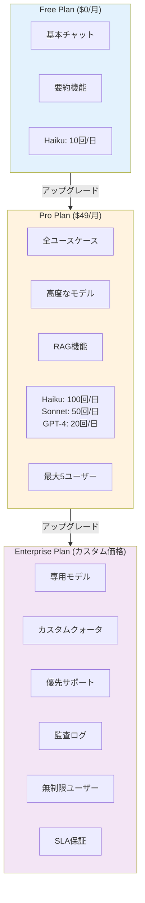
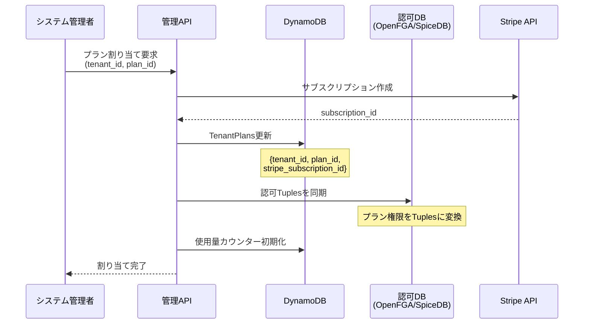

# プラン・クォータ管理ガイド

## 概要

本ドキュメントでは、認可システムにおけるプラン管理とクォータ管理の運用方法について説明します。テナント管理者やシステム管理者が、プランの作成・変更、クォータの設定・監視を行うための手順を提供します。

## プラン体系

### プラン階層図



### プラン比較表

| カテゴリ | Free | Pro | Enterprise |
|---------|------|-----|------------|
| **価格** | $0/月 | $49/月 | カスタム |
| **ユーザー数** | 1 | 5 | 無制限 |
| **ユースケース** | | | |
| └ チャット | ✓ | ✓ | ✓ |
| └ 要約 | ✓ | ✓ | ✓ |
| └ 文章生成 | - | ✓ | ✓ |
| └ 翻訳 | - | ✓ | ✓ |
| └ RAG チャット | - | ✓ | ✓ |
| └ 画像生成 | - | ✓ | ✓ |
| └ 動画生成 | - | - | ✓ |
| └ 音声チャット | - | - | ✓ |
| **モデル (日次クォータ)** | | | |
| └ Claude 3 Haiku | 10 | 100 | 無制限 |
| └ Claude 3 Sonnet | - | 50 | 無制限 |
| └ Claude 3 Opus | - | - | 100 |
| └ GPT-4 | - | 20 | 無制限 |
| └ GPT-4 Turbo | - | - | 無制限 |
| **リソース制限** | | | |
| └ 会話保存数 | 10 | 100 | 無制限 |
| └ RAG ドキュメント | - | 100MB | 10GB |
| └ ファイルアップロード | 10MB | 50MB | 500MB |
| **サポート** | | | |
| └ コミュニティフォーラム | ✓ | ✓ | ✓ |
| └ メールサポート | - | ✓ | ✓ |
| └ 優先サポート | - | - | ✓ |
| └ 専任担当者 | - | - | ✓ |
| **セキュリティ・監査** | | | |
| └ 基本認証 | ✓ | ✓ | ✓ |
| └ SAML SSO | - | ✓ | ✓ |
| └ 監査ログ | - | - | ✓ |
| └ SLA保証 | - | - | 99.9% |

## プラン設定

### プラン定義（DynamoDB）

```json
{
  "plan_id": "pro",
  "plan_name": "Professional",
  "price_usd_monthly": 49.99,
  "description": "中小企業向けプロフェッショナルプラン",
  "features": {
    "max_users": 5,
    "usecases": {
      "chat": { "enabled": true },
      "rag": { "enabled": true },
      "translation": { "enabled": true },
      "text_generation": { "enabled": true },
      "image_generation": { "enabled": true },
      "summarization": { "enabled": true },
      "document_extraction": { "enabled": true }
    },
    "models": {
      "claude-3-haiku": {
        "enabled": true,
        "daily_quota": 100,
        "monthly_quota": 3000,
        "burst_limit": 10
      },
      "claude-3-sonnet": {
        "enabled": true,
        "daily_quota": 50,
        "monthly_quota": 1500,
        "burst_limit": 5
      },
      "gpt-4": {
        "enabled": true,
        "daily_quota": 20,
        "monthly_quota": 600,
        "burst_limit": 3
      }
    },
    "resources": {
      "max_conversations": 100,
      "max_documents_mb": 100,
      "max_file_upload_mb": 50,
      "conversation_history_days": 90
    },
    "admin_operations": {
      "invite_user": true,
      "manage_users": true,
      "view_usage": true,
      "export_data": true
    }
  },
  "stripe_price_id": "price_1234567890",
  "created_at": 1704067200000,
  "updated_at": 1704067200000
}
```

### プラン作成 CLI

```bash
# プラン定義JSONファイル作成
cat > pro-plan.json << EOF
{
  "plan_id": "pro",
  "plan_name": "Professional",
  "price_usd_monthly": 49.99,
  ...
}
EOF

# DynamoDBに登録
aws dynamodb put-item \
  --table-name PlanPermissions \
  --item file://pro-plan.json
```

### プラン管理 Lambda API

```typescript
// packages/cdk/lambda/admin/manage-plans.ts
import { DynamoDBClient } from '@aws-sdk/client-dynamodb';
import { DynamoDBDocumentClient, PutCommand, GetCommand, DeleteCommand } from '@aws-sdk/lib-dynamodb';

const dynamoDB = DynamoDBDocumentClient.from(new DynamoDBClient({}));
const PLAN_TABLE = process.env.PLAN_TABLE!;

// プラン作成
export async function createPlan(planData: any) {
  await dynamoDB.send(
    new PutCommand({
      TableName: PLAN_TABLE,
      Item: {
        ...planData,
        created_at: Date.now(),
        updated_at: Date.now(),
      },
      ConditionExpression: 'attribute_not_exists(plan_id)',
    })
  );
}

// プラン取得
export async function getPlan(planId: string) {
  const result = await dynamoDB.send(
    new GetCommand({
      TableName: PLAN_TABLE,
      Key: { plan_id: planId },
    })
  );
  return result.Item;
}

// プラン更新
export async function updatePlan(planId: string, updates: any) {
  await dynamoDB.send(
    new PutCommand({
      TableName: PLAN_TABLE,
      Item: {
        ...updates,
        plan_id: planId,
        updated_at: Date.now(),
      },
    })
  );
}

// プラン削除
export async function deletePlan(planId: string) {
  await dynamoDB.send(
    new DeleteCommand({
      TableName: PLAN_TABLE,
      Key: { plan_id: planId },
    })
  );
}
```

## テナントへのプラン割り当て

### プラン割り当てフロー



### プラン割り当て実装

```typescript
// packages/cdk/lambda/admin/assign-plan.ts
import { DynamoDBClient } from '@aws-sdk/client-dynamodb';
import { DynamoDBDocumentClient, PutCommand, GetCommand } from '@aws-sdk/lib-dynamodb';
import { OpenFGAClient } from '@openfga/sdk';
import Stripe from 'stripe';

const dynamoDB = DynamoDBDocumentClient.from(new DynamoDBClient({}));
const fgaClient = new OpenFGAClient({ apiUrl: process.env.OPENFGA_API_URL! });
const stripe = new Stripe(process.env.STRIPE_SECRET_KEY!, {
  apiVersion: '2023-10-16',
});

export async function assignPlanToTenant(
  tenantId: string,
  planId: string,
  stripeCustomerId?: string
) {
  // 1. プラン情報取得
  const planResult = await dynamoDB.send(
    new GetCommand({
      TableName: process.env.PLAN_TABLE!,
      Key: { plan_id: planId },
    })
  );

  if (!planResult.Item) {
    throw new Error(`Plan ${planId} not found`);
  }

  const plan = planResult.Item;

  // 2. Stripeサブスクリプション作成（Proプラン以上の場合）
  let subscriptionId: string | undefined;
  if (planId !== 'free' && stripeCustomerId) {
    const subscription = await stripe.subscriptions.create({
      customer: stripeCustomerId,
      items: [{ price: plan.stripe_price_id }],
      metadata: {
        tenant_id: tenantId,
        plan_id: planId,
      },
    });
    subscriptionId = subscription.id;
  }

  // 3. DynamoDBにテナント-プラン関連付けを保存
  await dynamoDB.send(
    new PutCommand({
      TableName: process.env.TENANT_PLAN_TABLE!,
      Item: {
        tenant_id: tenantId,
        plan_id: planId,
        plan_name: plan.plan_name,
        stripe_subscription_id: subscriptionId,
        start_date: Date.now(),
        status: 'active',
      },
    })
  );

  // 4. 認可DBに権限を同期
  await syncPlanPermissionsToAuthzDB(tenantId, planId, plan.features);

  // 5. 使用量カウンター初期化
  await initializeUsageCounters(tenantId, plan.features.models);

  return {
    tenant_id: tenantId,
    plan_id: planId,
    subscription_id: subscriptionId,
  };
}

// 認可DBへの同期
async function syncPlanPermissionsToAuthzDB(
  tenantId: string,
  planId: string,
  features: any
) {
  const writes = [];

  // テナント-プラン関連付け
  writes.push({
    user: `tenant:${tenantId}`,
    relation: 'subscriber',
    object: `plan:${planId}`,
  });

  // ユースケース権限
  for (const [usecaseId, config] of Object.entries(features.usecases)) {
    if ((config as any).enabled) {
      writes.push({
        user: `plan:${planId}`,
        relation: 'allows_usecase',
        object: `usecase:${usecaseId}`,
      });
    }
  }

  // モデル権限
  for (const [modelId, config] of Object.entries(features.models)) {
    if ((config as any).enabled) {
      writes.push({
        user: `plan:${planId}`,
        relation: 'allows_model',
        object: `model:${modelId}`,
      });
    }
  }

  await fgaClient.write({ writes });
}

// 使用量カウンター初期化
async function initializeUsageCounters(tenantId: string, models: any) {
  const today = new Date().toISOString().split('T')[0];

  for (const [modelId, config] of Object.entries(models)) {
    if ((config as any).enabled) {
      await dynamoDB.send(
        new PutCommand({
          TableName: process.env.USAGE_TABLE!,
          Item: {
            pk: `${tenantId}#model`,
            sk: `${today}#${modelId}`,
            tenant_id: tenantId,
            model: modelId,
            count: 0,
            quota_limit: (config as any).daily_quota,
            date: today,
            last_reset: Date.now(),
          },
        })
      );
    }
  }
}
```

## クォータ管理

### クォータリセット自動化

```typescript
// packages/cdk/lambda/admin/reset-daily-quotas.ts
import { DynamoDBClient } from '@aws-sdk/client-dynamodb';
import { DynamoDBDocumentClient, ScanCommand, PutCommand } from '@aws-sdk/lib-dynamodb';

const dynamoDB = DynamoDBDocumentClient.from(new DynamoDBClient({}));

// 日次クォータリセット（CloudWatch Events で毎日00:00 UTC実行）
export async function resetDailyQuotas() {
  const today = new Date().toISOString().split('T')[0];

  // 全テナント-プランの組み合わせを取得
  const tenantsResult = await dynamoDB.send(
    new ScanCommand({
      TableName: process.env.TENANT_PLAN_TABLE!,
      FilterExpression: '#status = :active',
      ExpressionAttributeNames: { '#status': 'status' },
      ExpressionAttributeValues: { ':active': 'active' },
    })
  );

  if (!tenantsResult.Items) {
    return;
  }

  for (const tenant of tenantsResult.Items) {
    // プラン詳細取得
    const planResult = await dynamoDB.send(
      new GetCommand({
        TableName: process.env.PLAN_TABLE!,
        Key: { plan_id: tenant.plan_id },
      })
    );

    if (!planResult.Item) {
      continue;
    }

    const plan = planResult.Item;

    // 各モデルのカウンターをリセット
    for (const [modelId, config] of Object.entries(plan.features.models)) {
      if ((config as any).enabled) {
        await dynamoDB.send(
          new PutCommand({
            TableName: process.env.USAGE_TABLE!,
            Item: {
              pk: `${tenant.tenant_id}#model`,
              sk: `${today}#${modelId}`,
              tenant_id: tenant.tenant_id,
              model: modelId,
              count: 0,
              quota_limit: (config as any).daily_quota,
              date: today,
              last_reset: Date.now(),
            },
          })
        );
      }
    }
  }

  console.log(`Daily quotas reset for ${tenantsResult.Items.length} tenants`);
}
```

### クォータ監視ダッシュボード

```typescript
// packages/cdk/lambda/admin/get-quota-usage.ts
import { DynamoDBClient } from '@aws-sdk/client-dynamodb';
import { DynamoDBDocumentClient, QueryCommand } from '@aws-sdk/lib-dynamodb';

const dynamoDB = DynamoDBDocumentClient.from(new DynamoDBClient({}));

// テナントのクォータ使用量取得
export async function getQuotaUsage(tenantId: string, dateRange?: string[]) {
  const today = new Date().toISOString().split('T')[0];
  const startDate = dateRange?.[0] || today;
  const endDate = dateRange?.[1] || today;

  const result = await dynamoDB.send(
    new QueryCommand({
      TableName: process.env.USAGE_TABLE!,
      KeyConditionExpression: '#pk = :pk AND #sk BETWEEN :start AND :end',
      ExpressionAttributeNames: {
        '#pk': 'pk',
        '#sk': 'sk',
      },
      ExpressionAttributeValues: {
        ':pk': `${tenantId}#model`,
        ':start': `${startDate}#`,
        ':end': `${endDate}#~`,
      },
    })
  );

  // モデル別に集計
  const usage: Record<string, { current: number; limit: number; dates: any[] }> = {};

  for (const item of result.Items || []) {
    const model = item.model;
    if (!usage[model]) {
      usage[model] = { current: 0, limit: item.quota_limit, dates: [] };
    }
    usage[model].current += item.count;
    usage[model].dates.push({
      date: item.date,
      count: item.count,
    });
  }

  return usage;
}

// クォータ超過テナント一覧
export async function getQuotaExceededTenants() {
  const result = await dynamoDB.send(
    new ScanCommand({
      TableName: process.env.USAGE_TABLE!,
      FilterExpression: '#count >= #limit',
      ExpressionAttributeNames: {
        '#count': 'count',
        '#limit': 'quota_limit',
      },
    })
  );

  return result.Items || [];
}
```

## 使用量レポート

### 日次使用量レポート生成

```typescript
// packages/cdk/lambda/reports/generate-usage-report.ts
import { DynamoDBClient } from '@aws-sdk/client-dynamodb';
import { DynamoDBDocumentClient, ScanCommand } from '@aws-sdk/lib-dynamodb';
import { S3Client, PutObjectCommand } from '@aws-sdk/client-s3';

const dynamoDB = DynamoDBDocumentClient.from(new DynamoDBClient({}));
const s3 = new S3Client({});

export async function generateDailyUsageReport(date: string) {
  // 指定日の全使用量データを取得
  const result = await dynamoDB.send(
    new ScanCommand({
      TableName: process.env.USAGE_TABLE!,
      FilterExpression: '#date = :date',
      ExpressionAttributeNames: { '#date': 'date' },
      ExpressionAttributeValues: { ':date': date },
    })
  );

  const usageData = result.Items || [];

  // CSVレポート生成
  const csvHeader = 'tenant_id,model,count,quota_limit,utilization\n';
  const csvRows = usageData
    .map((item) => {
      const utilization = ((item.count / item.quota_limit) * 100).toFixed(2);
      return `${item.tenant_id},${item.model},${item.count},${item.quota_limit},${utilization}%`;
    })
    .join('\n');

  const csvContent = csvHeader + csvRows;

  // S3にアップロード
  await s3.send(
    new PutObjectCommand({
      Bucket: process.env.REPORTS_BUCKET!,
      Key: `usage-reports/${date}.csv`,
      Body: csvContent,
      ContentType: 'text/csv',
    })
  );

  console.log(`Usage report generated for ${date}`);

  return {
    date,
    total_entries: usageData.length,
    report_location: `s3://${process.env.REPORTS_BUCKET}/usage-reports/${date}.csv`,
  };
}
```

### QuickSight ダッシュボード連携

```sql
-- Athena クエリ例（S3レポートをクエリ）
SELECT
  tenant_id,
  model,
  SUM(count) as total_usage,
  AVG(CAST(REPLACE(utilization, '%', '') AS DOUBLE)) as avg_utilization
FROM usage_reports
WHERE date BETWEEN '2024-01-01' AND '2024-01-31'
GROUP BY tenant_id, model
ORDER BY total_usage DESC
LIMIT 10;
```

## アラート設定

### クォータ超過アラート

```typescript
// packages/cdk/lib/construct/authorization/quota-alerts.ts
import { Topic } from 'aws-cdk-lib/aws-sns';
import { EmailSubscription } from 'aws-cdk-lib/aws-sns-subscriptions';
import { Alarm, ComparisonOperator } from 'aws-cdk-lib/aws-cloudwatch';

export class QuotaAlerts extends Construct {
  constructor(scope: Construct, id: string) {
    super(scope, id);

    // SNS トピック作成
    const alertTopic = new Topic(this, 'QuotaAlertTopic', {
      displayName: 'Quota Alert Topic',
    });

    // メール購読追加
    alertTopic.addSubscription(
      new EmailSubscription('admin@example.com')
    );

    // CloudWatch アラーム
    const quotaAlarm = new Alarm(this, 'QuotaExceededAlarm', {
      metric: /* メトリクス定義 */,
      threshold: 90, // 90%
      evaluationPeriods: 1,
      comparisonOperator: ComparisonOperator.GREATER_THAN_THRESHOLD,
      alarmDescription: 'Quota utilization exceeded 90%',
    });

    quotaAlarm.addAlarmAction(new SnsAction(alertTopic));
  }
}
```

## Stripe Webhook 統合（将来実装）

```typescript
// packages/cdk/lambda/webhooks/stripe-webhook.ts
import Stripe from 'stripe';

const stripe = new Stripe(process.env.STRIPE_SECRET_KEY!, {
  apiVersion: '2023-10-16',
});

export async function handleStripeWebhook(event: any) {
  const signature = event.headers['stripe-signature'];
  const webhookSecret = process.env.STRIPE_WEBHOOK_SECRET!;

  let stripeEvent: Stripe.Event;

  try {
    stripeEvent = stripe.webhooks.constructEvent(
      event.body,
      signature,
      webhookSecret
    );
  } catch (err) {
    console.error('Webhook signature verification failed:', err);
    return { statusCode: 400 };
  }

  // イベント処理
  switch (stripeEvent.type) {
    case 'customer.subscription.created':
      await handleSubscriptionCreated(stripeEvent.data.object as Stripe.Subscription);
      break;

    case 'customer.subscription.updated':
      await handleSubscriptionUpdated(stripeEvent.data.object as Stripe.Subscription);
      break;

    case 'customer.subscription.deleted':
      await handleSubscriptionCanceled(stripeEvent.data.object as Stripe.Subscription);
      break;

    case 'invoice.payment_succeeded':
      await handlePaymentSucceeded(stripeEvent.data.object as Stripe.Invoice);
      break;

    case 'invoice.payment_failed':
      await handlePaymentFailed(stripeEvent.data.object as Stripe.Invoice);
      break;

    default:
      console.log(`Unhandled event type: ${stripeEvent.type}`);
  }

  return { statusCode: 200 };
}

async function handleSubscriptionCreated(subscription: Stripe.Subscription) {
  const tenantId = subscription.metadata.tenant_id;
  const planId = subscription.metadata.plan_id;

  await assignPlanToTenant(tenantId, planId, subscription.id);
}
```

## 運用チェックリスト

### 日次タスク
- [ ] クォータ超過アラートの確認
- [ ] 使用量レポートのレビュー
- [ ] 異常な使用パターンの検出

### 週次タスク
- [ ] プラン利用状況の分析
- [ ] コスト最適化の検討
- [ ] ユーザーフィードバックの確認

### 月次タスク
- [ ] 月次使用量レポートの作成
- [ ] プラン価格の見直し
- [ ] クォータ設定の最適化
- [ ] Stripe請求の確認

## トラブルシューティング

### よくある問題

#### 1. クォータが正しくリセットされない

**原因:** CloudWatch Eventsの実行タイミングまたはタイムゾーンの問題

**解決策:**
```bash
# Lambda関数のログ確認
aws logs tail /aws/lambda/reset-daily-quotas --follow

# 手動でクォータリセットを実行
aws lambda invoke \
  --function-name reset-daily-quotas \
  --payload '{"date": "2024-01-15"}' \
  response.json
```

#### 2. プラン変更が認可システムに反映されない

**原因:** 認可DBへの同期失敗

**解決策:**
```bash
# 同期ジョブを手動実行
aws lambda invoke \
  --function-name sync-plan-to-authz \
  --payload '{"tenant_id": "acme", "plan_id": "pro"}' \
  response.json
```

## まとめ

本ドキュメントでは、認可システムのプラン・クォータ管理について説明しました。これらの機能により、柔軟なサブスクリプション管理と公平なリソース配分が実現できます。

## 関連ドキュメント

- [認可システムMVP実装ガイド](./authorization-mvp.md)
- [認可スキーマ設計](./authorization-schema.md)
- [API統合ガイド](./authorization-api-integration.md)
