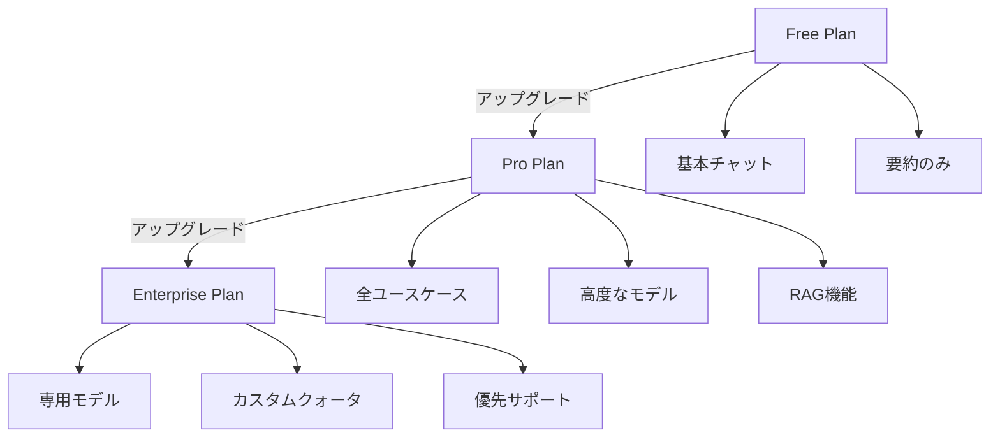

# 認可スキーマ設計

## 概要

本ドキュメントでは、OpenFGAとSpiceDBにおける認可スキーマの詳細設計を説明します。両システムともGoogle Zanzibar論文に基づく関係ベース認可（ReBAC: Relationship-Based Access Control）を採用しています。

## 基本概念

### エンティティタイプ

認可システムで管理する主要なエンティティ:

- **user**: システム利用者（Cognitoユーザー）
- **tenant**: テナント組織
- **plan**: サブスクリプションプラン（Free/Pro/Enterprise）
- **conversation**: チャット会話
- **document**: RAGドキュメント
- **usecase**: ユースケース（chat/rag/translation等）
- **model**: AI モデル（claude-3-sonnet, gpt-4等）
- **admin_operation**: 管理操作（ユーザー管理等）

### リレーション（関係）

エンティティ間の関係を定義:

- **member**: テナントのメンバーシップ
- **admin**: テナント管理者権限
- **owner**: リソース所有者
- **viewer**: 閲覧権限
- **editor**: 編集権限
- **executor**: 実行権限
- **subscriber**: プランサブスクライバー

## OpenFGA スキーマ設計

### モデル定義

```typescript
model
  schema 1.1

type user

type tenant
  relations
    define member: [user]
    define admin: [user]
    define plan_subscriber: [plan]

type plan
  relations
    define subscriber: [tenant]
    define allows_usecase: [usecase]
    define allows_model: [model]

type conversation
  relations
    define tenant: [tenant]
    define owner: [user]
    define viewer: [user] or owner or tenant#member
    define editor: [user] or owner

type document
  relations
    define tenant: [tenant]
    define owner: [user]
    define viewer: [user] or owner or tenant#member
    define uploader: [user]

type usecase
  relations
    define executor: [user] and plan_subscriber_check
    define allowed_by_plan: [plan]

type model
  relations
    define user: [user]
    define quota_available: quota_check from context
    define allowed_by_plan: [plan]
    define executor: [user] and quota_check and plan_check

type admin_operation
  relations
    define executor: [user] and tenant#admin
```

### Tuples（関係データ）の例

#### テナントメンバーシップ

```json
// ユーザー user:alice はテナント tenant:acme のメンバー
{
  "user": "user:alice",
  "relation": "member",
  "object": "tenant:acme"
}

// ユーザー user:bob はテナント tenant:acme の管理者
{
  "user": "user:bob",
  "relation": "admin",
  "object": "tenant:acme"
}
```

#### プランサブスクリプション

```json
// テナント tenant:acme はプラン plan:pro をサブスクライブ
{
  "user": "tenant:acme",
  "relation": "subscriber",
  "object": "plan:pro"
}

// プラン plan:pro はユースケース usecase:chat を許可
{
  "user": "plan:pro",
  "relation": "allows_usecase",
  "object": "usecase:chat"
}

// プラン plan:pro はモデル model:claude-3-sonnet を許可
{
  "user": "plan:pro",
  "relation": "allows_model",
  "object": "model:claude-3-sonnet"
}
```

#### リソースアクセス

```json
// 会話 conversation:123 はテナント tenant:acme に属する
{
  "user": "tenant:acme",
  "relation": "tenant",
  "object": "conversation:123"
}

// ユーザー user:alice は会話 conversation:123 の所有者
{
  "user": "user:alice",
  "relation": "owner",
  "object": "conversation:123"
}

// ユーザー user:charlie に conversation:123 の閲覧権限を付与
{
  "user": "user:charlie",
  "relation": "viewer",
  "object": "conversation:123"
}
```

#### クォータ管理（コンテキストベース）

```json
// モデルクォータの定義（DynamoDBと連携）
{
  "user": "user:alice",
  "relation": "quota_available",
  "object": "model:claude-3-sonnet",
  "condition": {
    "name": "daily_quota_check",
    "context": {
      "current_usage": 8,
      "quota_limit": 10
    }
  }
}
```

### 権限チェッククエリ例

```typescript
// ユーザーが会話を閲覧できるか？
await fgaClient.check({
  user: "user:alice",
  relation: "viewer",
  object: "conversation:123"
});
// 結果: { allowed: true }

// ユーザーがユースケースを実行できるか？
await fgaClient.check({
  user: "user:alice",
  relation: "executor",
  object: "usecase:chat",
  contextual_tuples: {
    user: "user:alice",
    relation: "member",
    object: "tenant:acme"
  }
});

// ユーザーがモデルを使用できるか？（クォータチェック含む）
await fgaClient.check({
  user: "user:alice",
  relation: "executor",
  object: "model:claude-3-sonnet",
  context: {
    current_usage: 8,
    quota_limit: 10,
    tenant_id: "acme",
    plan_id: "pro"
  }
});
```

## SpiceDB スキーマ設計

### Schema Definition

```spicedb
definition user {}

definition tenant {
    relation member: user
    relation admin: user
    relation subscribed_plan: plan

    permission view = member + admin
    permission manage = admin
}

definition plan {
    relation subscriber: tenant
    relation allowed_usecase: usecase
    relation allowed_model: model

    permission use = subscriber
}

definition conversation {
    relation tenant: tenant
    relation owner: user
    relation viewer: user

    permission view = viewer + owner + tenant->member
    permission edit = owner
    permission delete = owner + tenant->admin
}

definition document {
    relation tenant: tenant
    relation owner: user
    relation uploader: user
    relation viewer: user

    permission view = viewer + owner + tenant->member
    permission upload = tenant->member
    permission delete = owner + tenant->admin
}

definition usecase {
    relation allowed_by_plan: plan
    relation executor: user

    permission execute = executor & allowed_by_plan->subscriber->member
}

definition model {
    relation allowed_by_plan: plan

    permission execute = allowed_by_plan->subscriber->member
}

definition admin_operation {
    relation allowed_admin: user

    permission execute = allowed_admin
}
```

### Relationships（関係データ）の例

#### テナントメンバーシップ

```spicedb
// ユーザー alice はテナント acme のメンバー
tenant:acme#member@user:alice

// ユーザー bob はテナント acme の管理者
tenant:acme#admin@user:bob

// テナント acme はプラン pro をサブスクライブ
tenant:acme#subscribed_plan@plan:pro
```

#### プラン権限

```spicedb
// プラン pro をサブスクライブしているのはテナント acme
plan:pro#subscriber@tenant:acme

// プラン pro はユースケース chat を許可
plan:pro#allowed_usecase@usecase:chat

// プラン pro はモデル claude-3-sonnet を許可
plan:pro#allowed_model@model:claude-3-sonnet
```

#### リソースアクセス

```spicedb
// 会話 123 はテナント acme に属する
conversation:123#tenant@tenant:acme

// ユーザー alice は会話 123 の所有者
conversation:123#owner@user:alice

// ユーザー charlie は会話 123 の閲覧者
conversation:123#viewer@user:charlie
```

### Caveats（条件付き権限）

SpiceDBの強力な機能として、条件付き権限（Caveats）をサポートしています。クォータチェックに活用できます。

```spicedb
caveat quota_available(current_usage int, quota_limit int, model string) {
    current_usage < quota_limit
}

// 使用例
definition model {
    relation allowed_by_plan: plan
    relation user: user

    permission execute = (user & allowed_by_plan->subscriber->member) if quota_available
}

// Relationship with caveat
model:claude-3-sonnet#user@user:alice[quota_available:{"current_usage":8,"quota_limit":10,"model":"claude-3-sonnet"}]
```

### 権限チェッククエリ例

```typescript
// ユーザーが会話を閲覧できるか？
await spiceDBClient.checkPermission({
  resource: {
    objectType: "conversation",
    objectId: "123"
  },
  permission: "view",
  subject: {
    object: {
      objectType: "user",
      objectId: "alice"
    }
  }
});
// 結果: { permissionship: PERMISSIONSHIP_HAS_PERMISSION }

// ユーザーがモデルを実行できるか？（caveat付き）
await spiceDBClient.checkPermission({
  resource: {
    objectType: "model",
    objectId: "claude-3-sonnet"
  },
  permission: "execute",
  subject: {
    object: {
      objectType: "user",
      objectId: "alice"
    }
  },
  context: {
    current_usage: 8,
    quota_limit: 10,
    model: "claude-3-sonnet"
  }
});
```

## プラン設計

### プラン階層



### プラン別権限マトリックス

| 機能/プラン | Free | Pro | Enterprise |
|------------|------|-----|------------|
| **ユースケース** | | | |
| チャット | ✓ | ✓ | ✓ |
| 要約 | ✓ | ✓ | ✓ |
| 文章生成 | - | ✓ | ✓ |
| 翻訳 | - | ✓ | ✓ |
| RAG チャット | - | ✓ | ✓ |
| 画像生成 | - | ✓ | ✓ |
| 動画生成 | - | - | ✓ |
| 音声チャット | - | - | ✓ |
| **モデル** | | | |
| Claude 3 Haiku | ✓ (10/日) | ✓ (100/日) | ✓ (無制限) |
| Claude 3 Sonnet | - | ✓ (50/日) | ✓ (無制限) |
| Claude 3 Opus | - | - | ✓ (100/日) |
| GPT-4 | - | ✓ (20/日) | ✓ (無制限) |
| **リソース** | | | |
| 会話保存数 | 10 | 100 | 無制限 |
| RAG ドキュメント | - | 100MB | 10GB |
| **管理機能** | | | |
| ユーザー招待 | - | ✓ (5人) | ✓ (無制限) |
| テナント管理者 | - | ✓ | ✓ |
| 監査ログ | - | - | ✓ |

### DynamoDB プラン設定例

```json
// PlanPermissions テーブル
{
  "plan_id": "pro",
  "plan_name": "Professional",
  "permissions": {
    "usecases": {
      "chat": { "allowed": true },
      "rag": { "allowed": true },
      "translation": { "allowed": true },
      "image_generation": { "allowed": true },
      "text_generation": { "allowed": true }
    },
    "models": {
      "claude-3-haiku": {
        "allowed": true,
        "daily_quota": 100,
        "monthly_quota": 3000
      },
      "claude-3-sonnet": {
        "allowed": true,
        "daily_quota": 50,
        "monthly_quota": 1500
      },
      "gpt-4": {
        "allowed": true,
        "daily_quota": 20,
        "monthly_quota": 600
      }
    },
    "resources": {
      "max_conversations": 100,
      "max_documents_mb": 100,
      "max_users": 5
    },
    "admin_operations": {
      "invite_user": true,
      "manage_users": true,
      "view_usage": true
    }
  },
  "price_usd_monthly": 49.99
}
```

## スキーマ同期戦略

### DynamoDB → 認可DB の同期

プラン変更やクォータ更新時に、DynamoDBから認可DBへTuplesを同期する必要があります。

```typescript
// プラン変更時の同期処理
async function syncPlanToAuthzDB(
  tenantId: string,
  newPlanId: string,
  authzProvider: 'openfga' | 'spicedb'
) {
  // 1. 古いプランのTuplesを削除
  await removeOldPlanTuples(tenantId);

  // 2. 新しいプランのTuplesを作成
  const planPermissions = await getPlanPermissions(newPlanId);

  if (authzProvider === 'openfga') {
    // OpenFGA Tuples
    await fgaClient.write({
      writes: [
        // テナントのプランサブスクリプション
        {
          user: `tenant:${tenantId}`,
          relation: 'subscriber',
          object: `plan:${newPlanId}`
        },
        // プランが許可するユースケース
        ...planPermissions.usecases
          .filter(uc => uc.allowed)
          .map(uc => ({
            user: `plan:${newPlanId}`,
            relation: 'allows_usecase',
            object: `usecase:${uc.id}`
          })),
        // プランが許可するモデル
        ...planPermissions.models
          .filter(m => m.allowed)
          .map(m => ({
            user: `plan:${newPlanId}`,
            relation: 'allows_model',
            object: `model:${m.id}`
          }))
      ]
    });
  } else {
    // SpiceDB Relationships
    await spiceDBClient.writeRelationships({
      updates: [
        {
          operation: 'OPERATION_CREATE',
          relationship: {
            resource: { objectType: 'tenant', objectId: tenantId },
            relation: 'subscribed_plan',
            subject: { object: { objectType: 'plan', objectId: newPlanId } }
          }
        },
        // ... 以下同様
      ]
    });
  }

  // 3. クォータ情報を同期
  await syncQuotaToAuthzDB(tenantId, planPermissions);
}
```

### クォータカウンターの同期

```typescript
// 使用量更新時の同期
async function updateUsageCounter(
  tenantId: string,
  model: string,
  increment: number = 1
) {
  // 1. DynamoDB更新
  const result = await dynamoDB.update({
    TableName: 'TenantUsage',
    Key: {
      pk: `${tenantId}#model`,
      sk: `${getCurrentDate()}#${model}`
    },
    UpdateExpression: 'ADD #count :inc SET #lastUpdate = :now',
    ExpressionAttributeNames: {
      '#count': 'count',
      '#lastUpdate': 'last_update'
    },
    ExpressionAttributeValues: {
      ':inc': increment,
      ':now': Date.now()
    },
    ReturnValues: 'ALL_NEW'
  });

  const currentUsage = result.Attributes.count;
  const quotaLimit = await getQuotaLimit(tenantId, model);

  // 2. OpenFGA/SpiceDB のコンテキストを更新
  // （次回チェック時に最新の使用量が参照される）
  await updateAuthzContext(tenantId, model, {
    current_usage: currentUsage,
    quota_limit: quotaLimit
  });

  // 3. クォータ超過チェック
  if (currentUsage >= quotaLimit) {
    await triggerQuotaExceededAlert(tenantId, model);
  }
}
```

## マイグレーション戦略

既存テナントへの認可システム導入手順:

### 1. 初期データ移行

```typescript
// 既存テナント・ユーザーの移行
async function migrateExistingTenants() {
  const tenants = await getAllTenants(); // Cognito/DynamoDBから取得

  for (const tenant of tenants) {
    // デフォルトプラン割り当て（Freeプラン）
    await assignPlan(tenant.tenant_id, 'free');

    // テナントメンバーの移行
    const users = await getTenantUsers(tenant.tenant_id);
    for (const user of users) {
      await createAuthzRelationship(
        user.user_id,
        'member',
        `tenant:${tenant.tenant_id}`
      );

      // 管理者フラグがあれば管理者権限も付与
      if (user.custom_tenantAdmin === 'true') {
        await createAuthzRelationship(
          user.user_id,
          'admin',
          `tenant:${tenant.tenant_id}`
        );
      }
    }

    // 既存会話のオーナーシップ設定
    const conversations = await getConversations(tenant.tenant_id);
    for (const conv of conversations) {
      await createAuthzRelationship(
        `user:${conv.user_id}`,
        'owner',
        `conversation:${conv.id}`
      );
    }
  }
}
```

### 2. 段階的ロールアウト

```typescript
// フィーチャーフラグによる段階的有効化
const AUTHZ_ENABLED_TENANTS = new Set([
  'tenant-beta-1',
  'tenant-beta-2'
]);

function isAuthzEnabled(tenantId: string): boolean {
  return (
    process.env.AUTHZ_GLOBAL_ENABLED === 'true' ||
    AUTHZ_ENABLED_TENANTS.has(tenantId)
  );
}

// Lambda Authorizer内での分岐
if (isAuthzEnabled(tenantId)) {
  // 新しい認可システムを使用
  const decision = await checkAuthorization(user, resource, action);
  return generateIAMPolicy(decision);
} else {
  // 既存のロジック（Cognito属性ベース）
  return legacyAuthorizationCheck(user, resource);
}
```

## パフォーマンス最適化

### キャッシング戦略

```typescript
// Lambda Authorizerでのキャッシュ実装
import { LRUCache } from 'lru-cache';

const authzCache = new LRUCache<string, boolean>({
  max: 1000, // 最大1000エントリー
  ttl: 60000, // 1分間有効
});

function getCacheKey(userId: string, resource: string, action: string): string {
  return `${userId}:${resource}:${action}`;
}

async function checkAuthorizationWithCache(
  userId: string,
  resource: string,
  action: string
): Promise<boolean> {
  const cacheKey = getCacheKey(userId, resource, action);

  // キャッシュヒット
  if (authzCache.has(cacheKey)) {
    metrics.incrementCounter('authz_cache_hit');
    return authzCache.get(cacheKey)!;
  }

  // キャッシュミス：認可DBに問い合わせ
  metrics.incrementCounter('authz_cache_miss');
  const allowed = await performAuthzCheck(userId, resource, action);

  // 結果をキャッシュ
  authzCache.set(cacheKey, allowed);

  return allowed;
}
```

### バッチクエリ最適化

```typescript
// 複数リソースの一括チェック
async function checkBatchPermissions(
  userId: string,
  resources: Array<{ id: string; type: string }>,
  action: string
): Promise<Map<string, boolean>> {
  // OpenFGA Batch Check
  const requests = resources.map(r => ({
    user: `user:${userId}`,
    relation: action,
    object: `${r.type}:${r.id}`
  }));

  const results = await fgaClient.batchCheck(requests);

  return new Map(
    resources.map((r, i) => [r.id, results[i].allowed])
  );
}
```

## 次のステップ

- [API統合ガイド](./authorization-api-integration.md): 実装コード例とAPI統合
- [プラン・クォータ管理](./authorization-plan-quota.md): 運用ガイド
