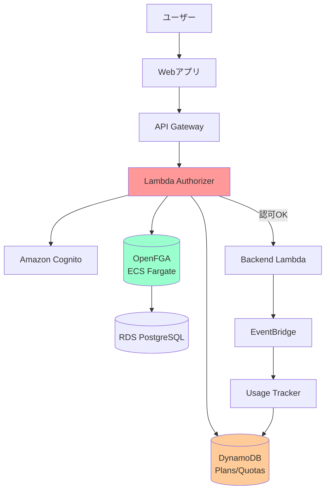
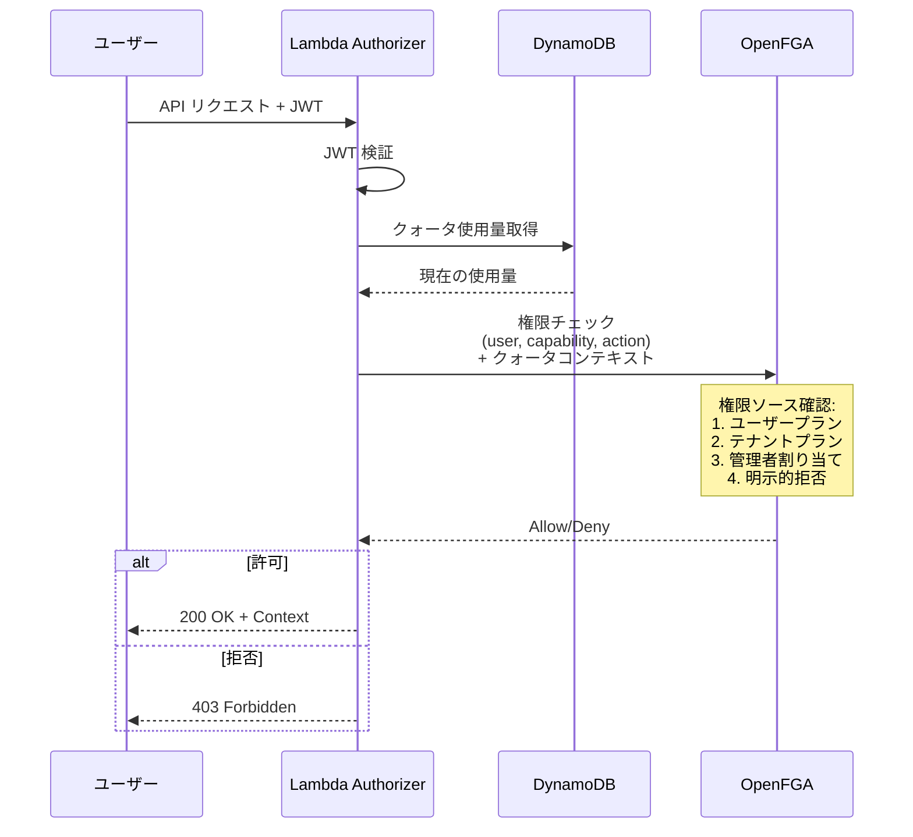

# OpenFGA デプロイメント・運用ガイド

## 目次

1. [概要](#概要)
2. [アーキテクチャ](#アーキテクチャ)
3. [デプロイ手順](#デプロイ手順)
4. [API リファレンス](#api-リファレンス)
5. [システム更新手順](#システム更新手順)
6. [トラブルシューティング](#トラブルシューティング)
7. [モニタリング](#モニタリング)

## 概要

このガイドでは、ECS Fargate上にOpenFGAをデプロイし、運用するための包括的な手順を説明します。OpenFGAは、ハイブリッド ToC (To Consumer) / ToB (To Business) ビジネスモデルをサポートする認可システムを提供します。

### 主な特徴

- **ハイブリッドビジネスモデル** - ToC（個人向け）とToB（法人向け）の両方をサポート
- **Entitlementベースの権限管理** - 柔軟な権限割り当てと継承
- **2段階クォータ管理** - テナント全体プール + 個別ユーザー制限
- **明示的拒否** - テナント管理者による特定機能のブロック
- **リソースレベル制御** - Conversation/Document の所有権と共有管理

## 前提条件

- AWS CLIがインストールされ、設定済み
- Node.js 20.x以上
- AWS CDKがインストール済み (`npm install -g aws-cdk`)
- VPCが作成済み
- OpenFGA CLI (`fga`) がインストール済み

## アーキテクチャ

### システム全体構成図



### ビジネスモデル対応

#### ToC (To Consumer) モデル
- 個人ユーザーが直接プランに登録
- テナント所属なしでも利用可能（無料ティア）
- ユーザー自身のプラン権限で機能アクセス

#### ToB (To Business) モデル
- テナント（組織）がプランに登録
- テナント管理者が個別ユーザーに権限付与
- テナントプラン + 管理者割り当ての組み合わせ

#### ハイブリッドモデル
- ユーザーが個人プラン**かつ**テナント所属
- **加算的統合** - どちらかのソースが許可すればアクセス可能
- テナント管理者による明示的拒否でオーバーライド可能

### 権限解決フロー



## デプロイ手順

### Step 1: CDKスタック作成

```typescript
import { Stack, StackProps } from 'aws-cdk-lib';
import { Construct } from 'constructs';
import { Vpc } from 'aws-cdk-lib/aws-ec2';
import { OpenFGADatabase, OpenFGAService } from '../lib/construct/openfga';

export class OpenFGAStack extends Stack {
  constructor(scope: Construct, id: string, props?: StackProps) {
    super(scope, id, props);

    // VPCの取得または作成
    const vpc = Vpc.fromLookup(this, 'VPC', {
      isDefault: true,
    });

    // PostgreSQLデータベース作成
    const database = new OpenFGADatabase(this, 'Database', {
      vpc,
      environment: 'poc',
      multiAz: false, // POCでは単一AZ
      instanceType: InstanceType.of(InstanceClass.T4G, InstanceSize.MICRO),
    });

    // OpenFGAサービス作成
    const openFGA = new OpenFGAService(this, 'Service', {
      vpc,
      database,
      environment: 'poc',
      desiredCount: 2,
      cpu: 256,
      memoryLimitMiB: 512,
      publicLoadBalancer: false, // 内部ALB
      enablePlayground: false, // 本番では無効化
    });

    // 出力
    new CfnOutput(this, 'OpenFGAEndpoint', {
      value: openFGA.endpoint,
      description: 'OpenFGA HTTP endpoint',
    });

    new CfnOutput(this, 'OpenFGAGrpcEndpoint', {
      value: openFGA.grpcEndpoint,
      description: 'OpenFGA gRPC endpoint',
    });
  }
}
```

## Step 2: デプロイ

```bash
# CDKブートストラップ (初回のみ)
cdk bootstrap

# スタックデプロイ
cdk deploy OpenFGAStack

# 出力されたエンドポイントを記録
# OpenFGAEndpoint = http://openfga-poc-ALB-xxx.us-east-1.elb.amazonaws.com:8080
# OpenFGAGrpcEndpoint = openfga-poc-ALB-xxx.us-east-1.elb.amazonaws.com:8081
```

## Step 3: データベースマイグレーション

OpenFGAは初回起動時に自動的にデータベースマイグレーションを実行します。

ログで確認:

```bash
# CloudWatch Logsで確認
aws logs tail /ecs/openfga-poc --follow

# 期待されるログ:
# "msg":"migrating datastore","module":"datastore","method":"postgres"
# "msg":"migration complete"
```

## Step 4: ストア作成

```bash
# OpenFGA CLIをインストール
brew install openfga/tap/fga

# または
go install github.com/openfga/cli/cmd/fga@latest

# ストア作成
fga store create --name "tenant-poc" \
  --api-url http://your-alb-endpoint:8080

# 出力例:
# {
#   "id": "01HQXYZ123456789ABCDEF",
#   "name": "tenant-poc",
#   "created_at": "2025-10-21T10:00:00Z"
# }

# Store IDを環境変数に保存
export OPENFGA_STORE_ID="01HQXYZ123456789ABCDEF"
```

## Step 5: スキーマ適用

```bash
# スキーマファイルの場所
cd packages/cdk/lib/construct/openfga

# スキーマをアップロード
fga model write \
  --store-id $OPENFGA_STORE_ID \
  --file authorization-schema.fga \
  --api-url http://your-alb-endpoint:8080

# モデルIDを確認
fga model list \
  --store-id $OPENFGA_STORE_ID \
  --api-url http://your-alb-endpoint:8080
```

## Step 6: サンプルデータ投入

```bash
# テナント作成
fga tuple write \
  --store-id $OPENFGA_STORE_ID \
  --api-url http://your-alb-endpoint:8080 \
  user:alice tenant:acme#member

# プラン割り当て
fga tuple write \
  --store-id $OPENFGA_STORE_ID \
  --api-url http://your-alb-endpoint:8080 \
  tenant:acme plan:pro#subscriber

# ユースケース権限
fga tuple write \
  --store-id $OPENFGA_STORE_ID \
  --api-url http://your-alb-endpoint:8080 \
  usecase:chat plan:pro#allowed_usecase

# モデル権限
fga tuple write \
  --store-id $OPENFGA_STORE_ID \
  --api-url http://your-alb-endpoint:8080 \
  model:claude-3-sonnet plan:pro#allowed_model
```

## Step 7: 権限チェックテスト

```bash
# ユーザーがチャット機能を使えるか?
fga query check \
  --store-id $OPENFGA_STORE_ID \
  --api-url http://your-alb-endpoint:8080 \
  user:alice execute usecase:chat

# 期待される出力:
# {
#   "allowed": true
# }

# モデルを使えるか?
fga query check \
  --store-id $OPENFGA_STORE_ID \
  --api-url http://your-alb-endpoint:8080 \
  user:alice execute model:claude-3-sonnet

# クォータ付きチェック (Lambda Authorizerで実装)
```

## Step 8: Lambda Authorizer設定

```typescript
import { AuthorizationSystem } from '../lib/construct/authorization/authorization-system';

// AuthorizationSystemをOpenFGA対応に更新
const authSystem = new AuthorizationSystem(this, 'AuthSystem', {
  userPool: cognito.userPool,
  userPoolClientId: cognito.userPoolClient.userPoolClientId,
  openFGAEndpoint: openFGA.endpoint,
  openFGAStoreId: process.env.OPENFGA_STORE_ID!,
  openFGAKeySecretArn: openFGA.presharedKeysSecret.secretArn,
  vpc: vpc,
});

// API Gatewayに適用
const api = new RestApi(this, 'Api', {
  defaultMethodOptions: {
    authorizer: new RequestAuthorizer(this, 'Authorizer', {
      handler: authSystem.authorizerFunction,
      identitySources: ['method.request.header.Authorization'],
      resultsCacheTtl: Duration.minutes(5),
    }),
  },
});
```

## トラブルシューティング

### 問題: データベース接続エラー

```
ERROR: could not connect to database: connection refused
```

**解決策:**
- セキュリティグループを確認
- RDSエンドポイントが正しいか確認
- VPCサブネットとルーティングを確認

```bash
# ECSタスクからRDSへの接続テスト
aws ecs execute-command \
  --cluster openfga-poc \
  --task <task-id> \
  --container openfga \
  --command "pg_isready -h <rds-endpoint> -p 5432" \
  --interactive
```

### 問題: 認証エラー

```
ERROR: authentication failed: invalid preshared key
```

**解決策:**
- Secrets Managerのキーを確認
- 環境変数 `OPENFGA_AUTHN_PRESHARED_KEYS` を確認

```bash
# シークレット確認
aws secretsmanager get-secret-value \
  --secret-id /openfga/poc/preshared-keys \
  --query SecretString \
  --output text | jq .
```

### 問題: パフォーマンス低下

```
WARNING: check latency > 100ms
```

**解決策:**
- キャッシュが有効か確認
- Fargateタスク数を増やす
- RDSインスタンスをスケールアップ

```bash
# メトリクス確認
aws cloudwatch get-metric-statistics \
  --namespace Authorization/OpenFGA \
  --metric-name OpenFGACheckLatency \
  --start-time $(date -u -d '1 hour ago' +%Y-%m-%dT%H:%M:%S) \
  --end-time $(date -u +%Y-%m-%dT%H:%M:%S) \
  --period 60 \
  --statistics Average,Maximum
```

## モニタリング

### CloudWatchダッシュボード作成

```typescript
import { Dashboard, GraphWidget } from 'aws-cdk-lib/aws-cloudwatch';

const dashboard = new Dashboard(this, 'OpenFGADashboard', {
  dashboardName: 'OpenFGA-POC',
});

dashboard.addWidgets(
  new GraphWidget({
    title: 'Authorization Latency',
    left: [authSystem.authorizerFunction.metricDuration()],
    right: [/* OpenFGA check latency metric */],
  })
);
```

### アラーム設定

```typescript
import { Alarm, ComparisonOperator } from 'aws-cdk-lib/aws-cloudwatch';
import { SnsAction } from 'aws-cdk-lib/aws-cloudwatch-actions';

const highLatencyAlarm = new Alarm(this, 'HighLatency', {
  metric: /* OpenFGA latency metric */,
  threshold: 100,
  evaluationPeriods: 2,
  comparisonOperator: ComparisonOperator.GREATER_THAN_THRESHOLD,
});

highLatencyAlarm.addAlarmAction(new SnsAction(alertTopic));
```

## API リファレンス

このセクションでは、OpenFGA 認可システムで利用可能な API とユーティリティ関数を説明します。

### OpenFGA Client ユーティリティ

すべてのOpenFGA操作は `packages/cdk/lambda/utils/openfgaClient.ts` モジュールを通じて行います。

#### 初期化

```typescript
import { getOpenFGAClient } from './utils/openfgaClient';

// シングルトンクライアントを取得（自動的にSecrets Managerからキー取得）
const client = await getOpenFGAClient();
```

**環境変数:**
- `OPENFGA_API_URL` - OpenFGA エンドポイント URL
- `OPENFGA_STORE_ID` - ストア ID
- `OPENFGA_KEY_SECRET_ARN` - API キーが格納された Secrets Manager ARN

---

### 権限チェック API

#### `checkUsecasePermission()`

ユーザーが特定のユースケース（チャット、RAG、翻訳等）を実行できるかチェックします。

```typescript
import { checkUsecasePermission } from './utils/openfgaClient';

const result = await checkUsecasePermission(
  'user123',    // ユーザーID
  'chat'        // ユースケースID: chat, rag, translation, etc.
);

if (result.allowed) {
  console.log('アクセス許可');
} else {
  console.log('アクセス拒否:', result.reason);
}
```

**戻り値:**
```typescript
{
  allowed: boolean;      // true = 許可, false = 拒否
  reason?: string;       // 拒否理由: 'permission_denied', 'check_error'
}
```

**権限ソース（加算的統合）:**
1. ユーザーの個人プラン登録（ToC）
2. テナントのプラン登録（ToB）
3. テナント管理者による直接割り当て（ToB）

**明示的拒否で無効:**
- テナント管理者が明示的にブロック設定した場合は、他のソースに関わらず拒否

---

#### `checkModelPermission()`

ユーザーが特定のAIモデル（Claude Sonnet、GPT-4等）を実行できるかチェックします。クォータコンテキストを渡すことで、使用量制限もチェックできます。

```typescript
import { checkModelPermission, QuotaContext } from './utils/openfgaClient';

// クォータコンテキスト作成
const quotaContext: QuotaContext = {
  userCurrentUsage: 8,        // ユーザーの現在使用量
  userQuotaLimit: 50,         // ユーザーのクォータ上限
  tenantCurrentUsage: 150,    // テナント全体の現在使用量（オプション）
  tenantQuotaLimit: 1000,     // テナント全体のクォータ上限（オプション）
};

const result = await checkModelPermission(
  'user123',
  'claude-3-sonnet',
  quotaContext
);

if (result.allowed) {
  console.log('モデル実行可能');
} else {
  console.log('モデル実行不可:', result.reason);
  // 理由: 'user_quota_exceeded', 'tenant_quota_exceeded', 'permission_denied'
}
```

**クォータチェックの仕組み:**
1. **事前チェック** - OpenFGA呼び出し前にアプリレベルでクォータ確認
2. **2段階検証** - ユーザー個別制限 AND テナントプール制限
3. **パフォーマンス最適化** - クォータ超過の場合、OpenFGA呼び出しをスキップ

**拒否理由:**
- `user_quota_exceeded` - ユーザー個別のクォータ上限超過
- `tenant_quota_exceeded` - テナント全体のクォータ上限超過
- `permission_denied` - 権限なし
- `check_error` - システムエラー

---

#### `checkResourcePermission()`

Conversation または Document に対する操作権限（閲覧、編集、削除）をチェックします。

```typescript
import { checkResourcePermission } from './utils/openfgaClient';

const result = await checkResourcePermission(
  'user123',
  'conversation',   // リソースタイプ: 'conversation' | 'document'
  'conv-456',       // リソースID
  'view'            // 権限: 'view' | 'edit' | 'delete' | 'upload'
);
```

**権限タイプ:**
- `view` - リソース閲覧（所有者、共有相手、テナントメンバー）
- `edit` - リソース編集（所有者のみ）
- `delete` - リソース削除（所有者、テナント管理者）
- `upload` - ドキュメントアップロード（テナントメンバー）

---

### プラン登録管理 API (ToC)

#### `grantUserPlanSubscription()`

ユーザーを個人プランに登録します（ToC モデル）。

```typescript
import { grantUserPlanSubscription } from './utils/openfgaClient';

await grantUserPlanSubscription(
  'user123',
  'pro'       // プランID: 'free', 'pro', 'enterprise'
);
```

**効果:**
- ユーザーはプランが提供するすべてのEntitlementを取得
- プラン継承がある場合、下位プランの機能も利用可能
- 例: `enterprise` プランは `pro` プランのすべての機能を含む

#### `revokeUserPlanSubscription()`

ユーザーの個人プラン登録を解除します。

```typescript
await revokeUserPlanSubscription('user123', 'pro');
```

**注意:**
- テナント経由の権限は影響を受けない
- ユーザーがテナントメンバーの場合、テナントプランの権限は維持

---

### テナントプラン管理 API (ToB)

#### `grantTenantPlanSubscription()`

テナント（組織）をプランに登録します（ToB モデル）。

```typescript
import { grantTenantPlanSubscription } from './utils/openfgaClient';

await grantTenantPlanSubscription(
  'acme-corp',
  'enterprise'
);
```

**効果:**
- テナントの全メンバーがプランの Entitlement を取得
- プラン継承により、下位プランの機能も利用可能

#### `revokeTenantPlanSubscription()`

テナントのプラン登録を解除します。

```typescript
await revokeTenantPlanSubscription('acme-corp', 'enterprise');
```

**影響範囲:**
- テナントメンバー全員がテナントプラン経由の権限を失う
- 個人プラン登録は影響を受けない（ハイブリッドモデルの場合）

---

### Entitlement 管理 API (ToB)

#### `grantTenantEntitlement()`

テナント管理者が特定ユーザーに個別に Entitlement を付与します。

```typescript
import { grantTenantEntitlement } from './utils/openfgaClient';

await grantTenantEntitlement(
  'acme-corp',         // テナントID
  'user123',           // ユーザーID
  'usecase_chat'       // Entitlement ID
);
```

**Entitlement ID の例:**
- `usecase_chat` - チャット機能
- `usecase_rag` - RAG機能
- `usecase_translation` - 翻訳機能
- `model_claude_sonnet` - Claude Sonnet モデル
- `model_gpt4` - GPT-4 モデル

**重要な前提条件:**
- Entitlement と Capability のマッピング（例: `entitlement:usecase_chat` → `usecase_capability:chat`）は事前にシステムセットアップで作成済みである必要があります
- この関数はテナント固有の割り当てのみを作成します

**使用シナリオ:**
- テナントプランに含まれない機能を特定ユーザーにのみ提供
- トライアル期間中の機能アクセス付与
- ロールベースの権限割り当て

#### `revokeTenantEntitlement()`

テナント管理者がユーザーから Entitlement を取り消します。

```typescript
await revokeTenantEntitlement('acme-corp', 'user123', 'usecase_chat');
```

---

### 明示的拒否 API (ToB)

#### `blockUserFromCapability()`

テナント管理者が特定ユーザーを特定機能から**明示的にブロック**します。これは他のすべての権限ソースをオーバーライドします。

```typescript
import { blockUserFromCapability } from './utils/openfgaClient';

await blockUserFromCapability(
  'acme-corp',
  'user123',
  'usecase',           // Capability タイプ: 'usecase' | 'model'
  'image_generation'   // Capability ID
);
```

**動作:**
- ユーザープラン、テナントプラン、管理者付与のすべてを無効化
- **最優先の拒否ルール** - 加算的統合より優先
- コンプライアンス要件やポリシー違反への対応に使用

**使用例:**
1. テナントポリシーで特定機能を禁止
2. セキュリティインシデント発生時の即時アクセス遮断
3. ユーザーの役割変更時の権限調整

#### `unblockUserFromCapability()`

明示的ブロックを解除します。

```typescript
await unblockUserFromCapability(
  'acme-corp',
  'user123',
  'usecase',
  'image_generation'
);
```

**注意:**
- ブロック解除後も、権限があるかは他のソース（プラン、Entitlement）次第

---

### テナントメンバーシップ API

#### `grantTenantMembership()`

ユーザーをテナントメンバーとして追加します。

```typescript
import { grantTenantMembership } from './utils/openfgaClient';

await grantTenantMembership('user123', 'acme-corp');
```

**効果:**
- テナントプランの権限を取得
- テナント内のリソース（Conversation、Document）へのアクセス
- テナント管理者による Entitlement 管理対象となる

#### `revokeTenantMembership()`

ユーザーをテナントから削除します。

```typescript
await revokeTenantMembership('user123', 'acme-corp');
```

**影響:**
- テナント経由の権限をすべて失う
- テナント管理者付与の Entitlement も無効化
- 個人プラン経由の権限は維持

#### `grantTenantAdmin()` / `revokeTenantAdmin()`

テナント管理者ロールの付与・削除。

```typescript
import { grantTenantAdmin, revokeTenantAdmin } from './utils/openfgaClient';

// 管理者権限付与
await grantTenantAdmin('user123', 'acme-corp');

// 管理者権限削除
await revokeTenantAdmin('user123', 'acme-corp');
```

**管理者権限:**
- テナントメンバーへの Entitlement 付与・削除
- ユーザーの明示的ブロック・解除
- テナント内リソースの削除
- クォータ設定の変更

---

### クォータ管理 API

#### `setUserQuotaGrant()`

テナント管理者がユーザーの個別クォータ制限を設定します。

```typescript
import { setUserQuotaGrant } from './utils/openfgaClient';

await setUserQuotaGrant(
  'user123',
  'acme-corp',
  'claude-3-sonnet'    // モデルID
);
```

**重要:**
- この関数は OpenFGA にタプルのみ作成します
- **実際のクォータ上限値**は別途 DynamoDB (`DYNAMODB_USER_QUOTA_TABLE`) に保存する必要があります
- 権限チェック時に DynamoDB から上限値を取得し、クォータコンテキストとして渡します

**クォータ設定の完全フロー:**
1. DynamoDB にユーザークォータ上限を保存
2. `setUserQuotaGrant()` で OpenFGA タプル作成
3. 権限チェック時に DynamoDB から上限取得
4. `checkModelPermission()` にクォータコンテキスト渡し

#### `removeUserQuotaGrant()`

ユーザーの個別クォータ設定を削除します。

```typescript
await removeUserQuotaGrant('user123', 'acme-corp', 'claude-3-sonnet');
```

**効果:**
- ユーザーはテナント全体のクォータプールのみに従う
- 個別制限がなくなる

---

### リソース管理 API

#### `setResourceOwner()`

Conversation または Document の所有者を設定します。

```typescript
import { setResourceOwner } from './utils/openfgaClient';

await setResourceOwner(
  'user123',
  'conversation',
  'conv-456',
  'acme-corp'    // オプション: テナントID
);
```

**権限:**
- 所有者は `view`, `edit`, `delete` 権限を持つ
- テナント指定時、テナントメンバーも `view` 可能
- テナント管理者は `delete` 可能

#### `shareResource()` / `unshareResource()`

リソースを他のユーザーと共有・共有解除します。

```typescript
import { shareResource, unshareResource } from './utils/openfgaClient';

// 共有
await shareResource('user456', 'conversation', 'conv-456');

// 共有解除
await unshareResource('user456', 'conversation', 'conv-456');
```

**共有権限:**
- 共有されたユーザーは `view` 権限のみ取得
- `edit`, `delete` は所有者のみ

---

### デバッグユーティリティ API

#### `listUserPermissions()`

ユーザーがアクセス可能なすべての Capability をリストアップします。

```typescript
import { listUserPermissions } from './utils/openfgaClient';

const usecases = await listUserPermissions('user123', 'usecase');
console.log('利用可能なユースケース:', usecases);
// ['usecase_capability:chat', 'usecase_capability:rag']

const models = await listUserPermissions('user123', 'model');
console.log('利用可能なモデル:', models);
// ['model_capability:claude-3-sonnet', 'model_capability:gpt-4']
```

**用途:**
- デバッグ
- UI での利用可能機能表示
- 管理画面での権限確認

#### `checkBatchPermissions()`

複数の権限チェックを並列実行します。

```typescript
import { checkBatchPermissions } from './utils/openfgaClient';

const checks = [
  { userId: 'user123', resourceType: 'conversation', resourceId: 'conv1', permission: 'view' },
  { userId: 'user123', resourceType: 'conversation', resourceId: 'conv2', permission: 'edit' },
  { userId: 'user123', resourceType: 'document', resourceId: 'doc1', permission: 'delete' },
];

const results = await checkBatchPermissions(checks);

results.forEach((allowed, key) => {
  console.log(`${key}: ${allowed ? '許可' : '拒否'}`);
});
```

**パフォーマンス:**
- 内部で `Promise.all()` を使用し並列実行
- OpenFGA はネイティブバッチ API を持たないため、複数リクエストを並行発行

---

### Lambda Authorizer インターフェース

Lambda Authorizer は API Gateway と統合し、すべてのリクエストで認可チェックを実行します。

**環境変数:**
```bash
# 必須
COGNITO_USER_POOL_ID=<Cognito User Pool ID>
COGNITO_CLIENT_ID=<Cognito Client ID>
OPENFGA_API_URL=http://your-alb:8080
OPENFGA_STORE_ID=<Store ID>
OPENFGA_KEY_SECRET_ARN=<Secret ARN>

# DynamoDB
DYNAMODB_USER_QUOTA_TABLE=<Table Name>
DYNAMODB_TENANT_QUOTA_TABLE=<Table Name>

# キャッシュ設定（オプション）
CACHE_ENABLED=true
CACHE_TTL_SECONDS=300
```

**レスポンス形式:**
```json
{
  "principalId": "user123",
  "policyDocument": {
    "Version": "2012-10-17",
    "Statement": [
      {
        "Action": "execute-api:Invoke",
        "Effect": "Allow",
        "Resource": "arn:aws:execute-api:*"
      }
    ]
  },
  "context": {
    "userId": "user123",
    "tenantId": "acme-corp",
    "permissions": "chat,rag"
  }
}
```

**API パスマッピング:**
- `/chat` → `usecase:chat`
- `/rag` → `usecase:rag`
- `/models/{id}` → `model:{id}` (クォータチェック付き)
- `/conversations/{id}` → `resource:conversation:{id}`
- `/documents/{id}` → `resource:document:{id}`

**キャッシュ動作:**
- 有効時: 同一ユーザー・リソースの権限チェック結果を TTL 期間キャッシュ
- 無効時: 毎回 OpenFGA にクエリ実行
- **推奨:** 本番環境では 5分（300秒）キャッシュ有効化

---

### Admin API エンドポイント（実装予定）

以下の Admin API は実装予定です。テナント管理者が Entitlement とクォータを管理するために使用します。

#### Entitlement 管理

```http
POST /admin/entitlements/grant
Content-Type: application/json
Authorization: Bearer <admin-jwt>

{
  "tenantId": "acme-corp",
  "userId": "user123",
  "entitlementId": "usecase_chat"
}
```

```http
POST /admin/entitlements/revoke
{
  "tenantId": "acme-corp",
  "userId": "user123",
  "entitlementId": "usecase_chat"
}
```

```http
POST /admin/entitlements/block
{
  "tenantId": "acme-corp",
  "userId": "user123",
  "capabilityType": "usecase",
  "capabilityId": "image_generation"
}
```

```http
POST /admin/entitlements/unblock
{
  "tenantId": "acme-corp",
  "userId": "user123",
  "capabilityType": "usecase",
  "capabilityId": "image_generation"
}
```

```http
GET /admin/entitlements/list?userId=user123
Authorization: Bearer <admin-jwt>

Response:
{
  "entitlements": [
    {
      "id": "usecase_chat",
      "source": "tenant_plan",
      "blocked": false
    },
    {
      "id": "model_claude_sonnet",
      "source": "admin_grant",
      "blocked": false
    }
  ]
}
```

#### クォータ管理

```http
POST /admin/quotas/set-user-limit
{
  "tenantId": "acme-corp",
  "userId": "user123",
  "modelId": "claude-3-sonnet",
  "dailyLimit": 50,
  "monthlyLimit": 1000
}
```

```http
DELETE /admin/quotas/remove-user-limit
{
  "tenantId": "acme-corp",
  "userId": "user123",
  "modelId": "claude-3-sonnet"
}
```

```http
GET /admin/quotas/usage?tenantId=acme-corp&userId=user123

Response:
{
  "user": {
    "currentUsage": 8,
    "dailyLimit": 50,
    "monthlyUsage": 245,
    "monthlyLimit": 1000
  },
  "tenant": {
    "currentUsage": 1500,
    "dailyLimit": 5000
  }
}
```

**認証:**
- すべての Admin API はテナント管理者権限が必要
- JWT トークンに `tenant_admin` クレームが含まれていることを確認
- クロステナント操作は禁止

---

## システム更新手順

このセクションでは、OpenFGA 認可システムの各種更新手順を説明します。

### スキーマ更新手順

OpenFGA の認可モデル（スキーマ）を更新する手順です。

#### 1. スキーマファイル編集

```bash
cd packages/cdk/lib/construct/openfga
vim authorization-schema.fga
```

**変更例: 新しい Capability タイプ追加**

```fga
# 新しい capability タイプを追加
type api_capability
  relations
    define entitlement: [entitlement]
    define blocked_by_tenant: [tenant_entitlement]

  permissions
    define can_execute: (holder from entitlement) but not (blocked from blocked_by_tenant)
```

#### 2. スキーマ検証（ローカル）

```bash
# OpenFGA CLI でスキーマ構文チェック
fga model validate --file authorization-schema.fga
```

#### 3. 開発環境でテスト

```bash
# 開発環境のストアにスキーマアップロード
export OPENFGA_STORE_ID="<dev-store-id>"
export OPENFGA_API_URL="http://dev-alb:8080"

fga model write \
  --store-id $OPENFGA_STORE_ID \
  --file authorization-schema.fga \
  --api-url $OPENFGA_API_URL

# モデルIDを記録
fga model list --store-id $OPENFGA_STORE_ID --api-url $OPENFGA_API_URL
```

**出力例:**
```
01HQXYZ123456789ABCDEF  2025-10-21T10:00:00Z
```

#### 4. スキーマテスト

```bash
# 新しいスキーマで権限チェックテスト
fga query check \
  --store-id $OPENFGA_STORE_ID \
  --api-url $OPENFGA_API_URL \
  user:alice execute api_capability:public_api

# タプル作成テスト
fga tuple write \
  --store-id $OPENFGA_STORE_ID \
  --api-url $OPENFGA_API_URL \
  api_capability:public_api entitlement entitlement:api_access
```

#### 5. 本番環境デプロイ

```bash
# 本番環境ストアにスキーマアップロード
export OPENFGA_STORE_ID="<prod-store-id>"
export OPENFGA_API_URL="http://prod-alb:8080"

fga model write \
  --store-id $OPENFGA_STORE_ID \
  --file authorization-schema.fga \
  --api-url $OPENFGA_API_URL
```

#### 6. ロールバック手順

スキーマに問題があった場合、以前のバージョンに戻すことができます。

```bash
# 現在のモデル一覧取得
fga model list --store-id $OPENFGA_STORE_ID --api-url $OPENFGA_API_URL

# 以前のモデルIDを確認し、明示的にそのIDを指定して権限チェック
# OpenFGAは自動的に最新モデルを使用するため、
# ロールバックは新しいモデルとして以前の定義を再アップロードする必要があります

# 古いスキーマファイルを再アップロード
fga model write \
  --store-id $OPENFGA_STORE_ID \
  --file authorization-schema-v1.fga \
  --api-url $OPENFGA_API_URL
```

**重要な注意:**
- OpenFGA は常に最新のモデルを使用します
- 古いモデルは履歴として残りますが、自動的には使用されません
- ロールバックは「以前の定義を新しいバージョンとして再アップロード」することで実現

---

### インフラストラクチャ更新手順

#### ECS Fargate タスク更新（OpenFGA バージョンアップ）

**ゼロダウンタイム更新:**

```bash
cd packages/cdk

# 1. CDK スタックコードを更新（新しい OpenFGA イメージタグ指定）
vim lib/construct/openfga/openfga-service.ts

# imageTag: 'v1.5.0' → 'v1.6.0' に変更

# 2. CDK デプロイ
cdk deploy OpenFGAStack

# ECS は自動的にローリング更新を実行:
# - 新しいタスクを起動
# - ヘルスチェック成功後、ALBに新タスクを追加
# - 古いタスクを停止
```

**更新確認:**
```bash
# ECS タスク状態確認
aws ecs list-tasks --cluster openfga-production

# ALB ターゲットヘルス確認
aws elbv2 describe-target-health \
  --target-group-arn <target-group-arn>

# OpenFGA バージョン確認
curl http://your-alb:8080/healthz
```

#### RDS インスタンスタイプ変更（スケールアップ）

```bash
# 1. CDK コード更新
vim lib/construct/openfga/openfga-database.ts

# instanceType: InstanceType.of(InstanceClass.T4G, InstanceSize.MICRO)
# ↓
# instanceType: InstanceType.of(InstanceClass.T4G, InstanceSize.SMALL)

# 2. デプロイ（Multi-AZ の場合、ダウンタイムほぼゼロ）
cdk deploy OpenFGAStack

# RDS は自動的にフェイルオーバーを利用して更新
```

**更新確認:**
```bash
# RDS インスタンス状態確認
aws rds describe-db-instances \
  --db-instance-identifier openfga-production-db

# 接続テスト
psql -h <rds-endpoint> -U openfga -d openfga -c "SELECT version();"
```

#### Lambda Authorizer 更新

```bash
# 1. Lambda 関数コード更新
vim packages/cdk/lambda/authorizer/authorization-authorizer.ts

# 2. Lambda Layer 更新（依存関係変更時）
cd packages/cdk/lambda/layers/openfga-sdk
npm install @openfga/sdk@latest

# 3. CDK デプロイ
cd ../../../../
cdk deploy AuthStack

# Lambda は自動的に新しいバージョンを作成し、エイリアスを更新
```

**更新確認:**
```bash
# Lambda バージョン確認
aws lambda get-function --function-name authorization-authorizer

# テスト実行
aws lambda invoke \
  --function-name authorization-authorizer \
  --payload file://test-event.json \
  response.json

cat response.json
```

**エラー時のロールバック:**
```bash
# 前のバージョンにロールバック
aws lambda update-alias \
  --function-name authorization-authorizer \
  --name PROD \
  --function-version <previous-version>
```

---

### プラン管理手順

#### 新しいプランの追加

**1. DynamoDB にプラン定義を追加:**

```bash
aws dynamodb put-item \
  --table-name PlanDefinitions \
  --item '{
    "plan_id": {"S": "team"},
    "plan_name": {"S": "Team Plan"},
    "tier": {"S": "team"},
    "monthly_price": {"N": "49"},
    "entitlements": {"L": [
      {"S": "usecase_chat"},
      {"S": "usecase_rag"},
      {"S": "model_claude_sonnet"}
    ]},
    "quotas": {"M": {
      "claude_sonnet_daily": {"N": "100"},
      "claude_sonnet_monthly": {"N": "2000"}
    }}
  }'
```

**2. OpenFGA にプラン Entitlement マッピングを追加:**

```bash
# プランが提供する Entitlement をリンク
fga tuple write --store-id $OPENFGA_STORE_ID \
  plan:team entitles entitlement:usecase_chat

fga tuple write --store-id $OPENFGA_STORE_ID \
  plan:team entitles entitlement:usecase_rag

fga tuple write --store-id $OPENFGA_STORE_ID \
  plan:team entitles entitlement:model_claude_sonnet
```

**3. Entitlement から Capability へのマッピング（初回のみ）:**

```bash
# Entitlement を Capability にリンク（システムセットアップ時に一度だけ実行）
fga tuple write --store-id $OPENFGA_STORE_ID \
  usecase_capability:chat entitlement entitlement:usecase_chat

fga tuple write --store-id $OPENFGA_STORE_ID \
  usecase_capability:rag entitlement entitlement:usecase_rag

fga tuple write --store-id $OPENFGA_STORE_ID \
  model_capability:claude-3-sonnet entitlement entitlement:model_claude_sonnet
```

**4. プラン継承の設定（オプション）:**

```bash
# Team プランが Free プランのすべての機能を含む場合
fga tuple write --store-id $OPENFGA_STORE_ID \
  plan:team includes plan:free
```

**5. テスト:**

```bash
# ユーザーを新プランに登録
fga tuple write --store-id $OPENFGA_STORE_ID \
  user:testuser plan:team#user_subscriber

# 権限チェック
fga query check --store-id $OPENFGA_STORE_ID \
  user:testuser can_execute usecase_capability:chat
```

#### プラン変更（ユーザー・テナント）

**ToC: ユーザープラン変更**

```bash
# 古いプラン削除
fga tuple delete --store-id $OPENFGA_STORE_ID \
  user:user123 plan:free#user_subscriber

# 新しいプラン追加
fga tuple write --store-id $OPENFGA_STORE_ID \
  user:user123 plan:pro#user_subscriber
```

**ToB: テナントプラン変更**

```bash
# 古いプラン削除
fga tuple delete --store-id $OPENFGA_STORE_ID \
  tenant:acme plan:basic#tenant_subscriber

fga tuple delete --store-id $OPENFGA_STORE_ID \
  tenant:acme plan_subscription plan:basic

# 新しいプラン追加
fga tuple write --store-id $OPENFGA_STORE_ID \
  tenant:acme plan:enterprise#tenant_subscriber

fga tuple write --store-id $OPENFGA_STORE_ID \
  tenant:acme plan_subscription plan:enterprise
```

**注意:**
- プランダウングレード時、既存の Entitlement 割り当てを確認
- ユーザーが依存している機能がある場合、事前通知が必要

---

### クォータ制限の更新

#### テナント全体のクォータ更新

```bash
# DynamoDB のテナントクォータテーブルを更新
aws dynamodb update-item \
  --table-name TenantQuotaLimits \
  --key '{"tenant_id": {"S": "acme-corp"}, "model_id": {"S": "claude-3-sonnet"}}' \
  --update-expression "SET daily_limit = :new_limit" \
  --expression-attribute-values '{":new_limit": {"N": "10000"}}'
```

#### ユーザー個別クォータ更新

```bash
# 1. DynamoDB にクォータ上限を保存
aws dynamodb put-item \
  --table-name UserQuotaLimits \
  --item '{
    "user_id": {"S": "user123"},
    "tenant_model": {"S": "acme-corp#claude-3-sonnet"},
    "daily_limit": {"N": "50"},
    "monthly_limit": {"N": "1000"},
    "set_by_admin": {"S": "admin456"}
  }'

# 2. OpenFGA に quota_grant タプルを作成（まだ存在しない場合）
# openfgaClient.setUserQuotaGrant() を使用
```

**TypeScript コード例:**
```typescript
import { setUserQuotaGrant } from './utils/openfgaClient';
import { DynamoDB } from '@aws-sdk/client-dynamodb';

// 1. DynamoDB にクォータ保存
const dynamodb = new DynamoDB({});
await dynamodb.putItem({
  TableName: 'UserQuotaLimits',
  Item: {
    user_id: { S: 'user123' },
    tenant_model: { S: 'acme-corp#claude-3-sonnet' },
    daily_limit: { N: '50' },
    monthly_limit: { N: '1000' },
  },
});

// 2. OpenFGA タプル作成
await setUserQuotaGrant('user123', 'acme-corp', 'claude-3-sonnet');
```

---

### データマイグレーション手順

#### 既存ユーザーの権限を新スキーマに移行

**マイグレーションスクリプト例:**

```typescript
// packages/cdk/lambda/migrations/migrate-to-entitlements.ts
import { getOpenFGAClient } from '../utils/openfgaClient';

async function migrateUserPermissions() {
  const client = await getOpenFGAClient();

  // 1. 古いスキーマから既存の権限を読み取り
  const oldTuples = await client.read({
    // 古いタプル形式: user:alice execute usecase:chat
  });

  // 2. 新しいスキーマ形式に変換
  for (const tuple of oldTuples.tuples) {
    const userId = tuple.key.user;
    const capability = tuple.key.object;

    // ユーザーのテナントを確認
    const tenant = await getUserTenant(userId);

    if (tenant) {
      // ToB: テナント経由の権限に変換
      await grantTenantEntitlement(tenant, userId, mapToEntitlement(capability));
    } else {
      // ToC: 個人プランに登録
      await grantUserPlanSubscription(userId, 'free');
    }
  }

  // 3. 検証
  console.log('Migration complete. Validating...');
  await validateMigration();
}
```

**マイグレーション実行:**
```bash
# Lambda 関数として実行
aws lambda invoke \
  --function-name migration-to-entitlements \
  --payload '{}' \
  response.json

# ログ確認
aws logs tail /aws/lambda/migration-to-entitlements --follow
```

---

## 次のステップ

- [ ] 負荷テスト実施 (k6/Locust)
- [ ] パフォーマンスチューニング
- [ ] マルチテナントストア管理の自動化
- [ ] 本番環境へのデプロイ計画
- [ ] 監視ダッシュボード作成
- [ ] アラート設定の最適化

## 参考資料

- [OpenFGA Documentation](https://openfga.dev/docs)
- [OpenFGA API Reference](https://openfga.dev/api/service)
- [AWS ECS Fargate Best Practices](https://docs.aws.amazon.com/AmazonECS/latest/bestpracticesguide/intro.html)
- [認可スキーマ詳細](../specs/authorization/authorization-schema.md)
- [OpenFGA 実装ガイド](../specs/authorization/openfga-implementation.md)
