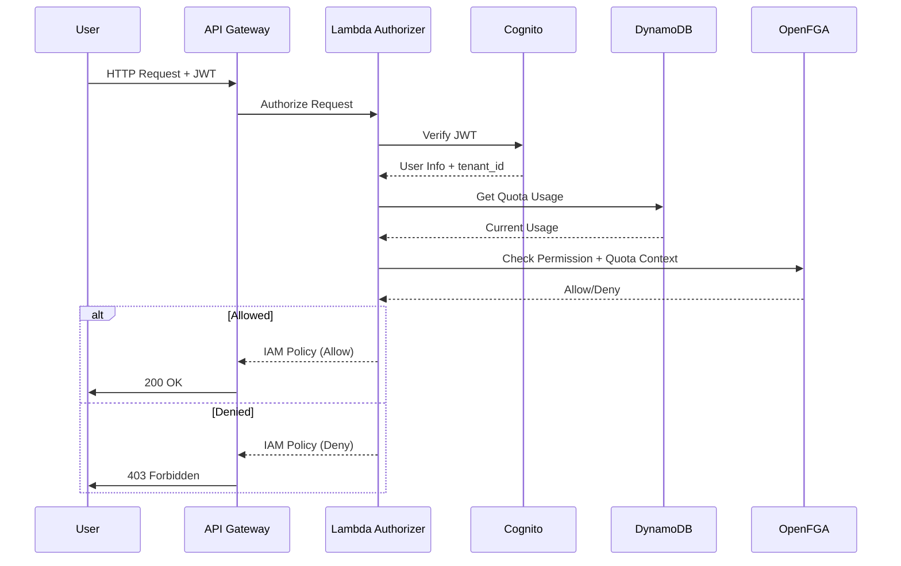

# OpenFGA Authorization System - Complete Guide

**Version:** 1.0
**Last Updated:** 2025-10-22
**Status:** Production Ready

This comprehensive guide covers the complete OpenFGA-based authorization system, including architecture, implementation, deployment, API reference, and operational procedures.

## Table of Contents

1. [Overview](#overview)
2. [Architecture](#architecture)
3. [Authorization Schema](#authorization-schema)
4. [CDK Implementation](#cdk-implementation)
5. [Lambda Authorizer](#lambda-authorizer)
6. [Admin APIs](#admin-apis)
7. [DynamoDB Schema](#dynamodb-schema)
8. [Deployment Guide](#deployment-guide)
9. [Testing](#testing)
10. [Migration Guide](#migration-guide)
11. [Implementation Status](#implementation-status)
12. [Troubleshooting](#troubleshooting)

---

## Overview

The OpenFGA authorization system provides a production-ready, scalable authorization service supporting hybrid To-Consumer (ToC) and To-Business (ToB) business models with entitlement-based permissions.

### Key Features

- **Hybrid Business Models** - Support for both ToC (individual subscriptions) and ToB (organization subscriptions)
- **Entitlement-Based Permissions** - Flexible permission assignment with inheritance
- **Two-Level Quota Management** - Tenant-wide pool + individual user limits
- **Explicit Deny** - Admin override capability for blocking access
- **Resource-Level Control** - Fine-grained permissions for conversations and documents

### Technology Stack

- **OpenFGA v1.5.0+** - Zanzibar-based authorization engine
- **ECS Fargate** - Serverless container platform
- **RDS PostgreSQL 15.4** - Relationship storage
- **AWS Lambda** - Authorizer function
- **DynamoDB** - Plan definitions and quota tracking
- **Application Load Balancer** - HTTP (8080) and gRPC (8081) endpoints

### Cost Estimation

**Production Environment:**
- ECS Fargate (3-5 tasks × 0.5 vCPU): $54-90/month
- RDS db.t4g.small (Multi-AZ): $60/month
- ALB: $16/month
- **Total: ~$130-166/month**

**Savings vs SpiceDB+EKS: 70-75%**

---

## Architecture

### Deployment Options

The authorization system can be deployed in two configurations:

#### Option A: Standalone Stack (Recommended for Production)
- Deployed in separate AWS account/region from application
- Dedicated VPC and isolated infrastructure
- Independent scaling and fault isolation
- Enhanced security boundaries
- Cross-account access via VPC endpoints

#### Option B: Embedded Stack (Development/POC)
- Deployed in same account as application stacks
- Shared VPC and infrastructure
- Lower latency and simplified networking
- Reduced operational complexity
- Suitable for development and testing

### System Components

```
┌─────────────────┐
│  Lambda/ECS     │
│  Applications   │
└────────┬────────┘
         │
         ▼
┌─────────────────┐      ┌──────────────────┐
│       ALB       │─────▶│ ECS Fargate      │
│  (HTTP + gRPC)  │      │ - OpenFGA Tasks  │
│                 │      │ - Auto-scaling   │
└─────────────────┘      └────────┬─────────┘
                                  │
                         ┌────────▼─────────┐
                         │ RDS PostgreSQL   │
                         │ - Encrypted      │
                         │ - Multi-AZ (opt) │
                         └──────────────────┘
```

### Multi-Tenant System Architecture

```
┌─────────────────────────────────────────────────────────────────┐
│                     AWS Account (prod-account)                  │
├─────────────────────────────────────────────────────────────────┤
│                                                                 │
│  ┌──────────────────────────────────────────────────────────┐  │
│  │         AUTHORIZATION STACK (Separate/Common)            │  │
│  │                                                          │  │
│  │  ┌──────────────┐     ┌──────────────┐                 │  │
│  │  │ OpenFGA      │────▶│ PostgreSQL   │                 │  │
│  │  │ (ECS Fargate)│     │ (RDS)        │                 │  │
│  │  └──────┬───────┘     └──────────────┘                 │  │
│  │         │                                               │  │
│  │  ┌──────▼────────────────┐                             │  │
│  │  │ ALB (8080, 8081)      │                             │  │
│  │  │ Pre-shared keys (SM)  │                             │  │
│  │  └──────┬────────────────┘                             │  │
│  │         │                                               │  │
│  │  ┌──────▼────────────────┐                             │  │
│  │  │ Lambda Authorizer     │                             │  │
│  │  │ (Checks permissions)  │                             │  │
│  │  └──────┬────────────────┘                             │  │
│  │         │                                               │  │
│  └─────────┼───────────────────────────────────────────────┘  │
│            │                                                   │
│            │ Authorizes API requests                          │
│            │                                                   │
│  ┌─────────▼──────────────────────────────────────────────┐   │
│  │         COMMON APPLICATION STACK                       │   │
│  │  ┌──────────────────────────────────────────────────┐  │   │
│  │  │ API Gateway + Lambda functions                  │  │   │
│  │  │ (Chat, RAG, Image, Video, etc.)                 │  │   │
│  │  └──────────────────────────────────────────────────┘  │   │
│  └────────────┬─────────────────────────────────────────┘   │
│               │                                               │
│               │ Routes to tenant-specific resources          │
│               │                                               │
│  ┌────────────▼──────────────────────────────────────────┐   │
│  │    TENANT STACKS (1 per tenant)                       │   │
│  │                                                       │   │
│  │  Tenant A:                  Tenant B:                │   │
│  │  ├─ DynamoDB                ├─ DynamoDB             │   │
│  │  ├─ S3 Buckets (3)          ├─ S3 Buckets (3)       │   │
│  │  ├─ VPC (isolated)          ├─ VPC (isolated)       │   │
│  │  ├─ IAM Roles               ├─ IAM Roles            │   │
│  │  └─ OpenSearch              └─ OpenSearch           │   │
│  │                                                       │   │
│  └───────────────────────────────────────────────────────┘   │
│                                                                 │
└─────────────────────────────────────────────────────────────────┘
```

**Authorization Flow:**
1. User authenticates via Cognito
2. Request hits API Gateway with JWT
3. Lambda Authorizer verifies JWT + checks OpenFGA permissions
4. OpenFGA knows which tenant user belongs to (via Cognito claims)
5. OpenFGA returns Allow/Deny based on:
   - User's entitlements
   - Tenant's entitlements
   - Quotas (DynamoDB storage)
6. API Gateway routes to tenant-specific Lambda
7. Lambda accesses tenant-isolated resources (DynamoDB, S3, etc.)

### Authorization Flow



### Business Models

#### ToC (To-Consumer)
- Individual users subscribe to plans directly
- Users can exist without tenant membership
- Permissions from user's own plan subscription

#### ToB (To-Business)
- Tenant (organization) subscribes to plan
- Tenant admins assign entitlements to users
- Permissions from tenant plan + admin assignments

#### Hybrid
- Users have BOTH direct plan AND tenant membership
- **Additive union** - access granted if ANY source allows
- Tenant admins can explicitly deny to override

---

## Authorization Schema

### Core Concepts

**Entitlements** are first-class objects representing specific capabilities. Sources:
1. User's plan subscription (ToC)
2. Tenant's plan subscription (ToB)
3. Direct admin assignment (ToB)
4. Plan inheritance

**Permission Resolution** uses additive union - user has access if ANY source grants it, unless explicitly denied.

### Schema Definition

The complete OpenFGA schema is in `authorization-schema.fga`. Key types:

#### User and Plans

```typescript
type user

type plan
  relations
    define user_subscriber: [user]
    define tenant_subscriber: [tenant]
    define entitles: [entitlement]
    define includes: [plan]
```

#### Entitlements

```typescript
type entitlement
  relations
    define via_user_plan: [plan]
    define via_tenant_plan: [plan]
    define via_tenant_assignment: [tenant_entitlement]

  permissions
    define holder: (user_subscriber from via_user_plan) or
                   (member from via_tenant_plan) or
                   (grantee from via_tenant_assignment)
```

#### Capabilities

```typescript
type usecase_capability
  relations
    define entitlement: [entitlement]
    define blocked_by_tenant: [tenant_entitlement]

  permissions
    define can_execute: (holder from entitlement) but not (blocked from blocked_by_tenant)

type model_capability
  relations
    define entitlement: [entitlement]
    define quota_grant: [quota_grant]
    define blocked_by_tenant: [tenant_entitlement]

  permissions
    define can_execute: (holder from entitlement) and
                       (has_quota from quota_grant) but not
                       (blocked from blocked_by_tenant)
```

#### Quota Management

```typescript
type quota_grant
  relations
    define user: [user]
    define tenant: [tenant]
    define model: [model_capability]

  permissions
    define has_quota: (user and tenant and model) and
                     user_quota_available and
                     tenant_quota_available

condition user_quota_available(user_current_usage: int, user_quota_limit: int) {
    user_current_usage < user_quota_limit
}

condition tenant_quota_available(tenant_current_usage: int, tenant_quota_limit: int) {
    tenant_current_usage < tenant_quota_limit
}
```

#### Resources

```typescript
type conversation
  relations
    define tenant: [tenant]
    define owner: [user]
    define viewer: [user]

  permissions
    define can_view: viewer or owner or (member from tenant)
    define can_edit: owner
    define can_delete: owner or (admin from tenant)

type document
  relations
    define tenant: [tenant]
    define owner: [user]
    define viewer: [user]

  permissions
    define can_view: viewer or owner or (member from tenant)
    define can_upload: member from tenant
    define can_delete: owner or (admin from tenant)
```

### Usage Examples

#### ToC Standalone User

```bash
# User subscribes to free plan
fga tuple write user:alice plan:free#user_subscriber

# Free plan provides chat entitlement
fga tuple write plan:free entitles entitlement:usecase_chat
fga tuple write entitlement:usecase_chat via_user_plan plan:free

# Link entitlement to capability
fga tuple write usecase_capability:chat entitlement entitlement:usecase_chat

# Check permission
fga query check user:alice can_execute usecase_capability:chat
# ✓ Allowed via user's free plan
```

#### ToB Admin Grant

```bash
# Admin grants chat to specific user
fga tuple write tenant_entitlement:acme/charlie/chat tenant tenant:acme
fga tuple write tenant_entitlement:acme/charlie/chat grantee user:charlie
fga tuple write entitlement:usecase_chat via_tenant_assignment tenant_entitlement:acme/charlie/chat

# Check permission
fga query check user:charlie can_execute usecase_capability:chat
# ✓ Allowed via admin assignment
```

#### Explicit Deny

```bash
# Admin blocks user from capability
fga tuple write tenant_entitlement:acme/dave/block tenant tenant:acme
fga tuple write tenant_entitlement:acme/dave/block blocked user:dave
fga tuple write usecase_capability:image_generation blocked_by_tenant tenant_entitlement:acme/dave/block

# Check permission
fga query check user:dave can_execute usecase_capability:image_generation
# ✗ Denied - explicit block overrides other sources
```

#### Quota Check

```bash
# Set individual quota
fga tuple write quota_grant:acme/eve/opus user user:eve
fga tuple write quota_grant:acme/eve/opus tenant tenant:acme
fga tuple write quota_grant:acme/eve/opus model model_capability:claude-opus

# Check with context
fga query check user:eve can_execute model_capability:claude-opus \
  --context '{"user_current_usage":8,"user_quota_limit":10,"tenant_current_usage":75,"tenant_quota_limit":100}'
# ✓ Allowed (8 < 10 AND 75 < 100)
```

---

## CDK Implementation

### OpenFGA Database

Creates a managed RDS PostgreSQL instance optimized for OpenFGA.

```typescript
import { OpenFGADatabase } from './construct/openfga';
import { InstanceType, InstanceClass, InstanceSize } from 'aws-cdk-lib/aws-ec2';

const database = new OpenFGADatabase(this, 'Database', {
  vpc,
  environment: 'production',

  // Instance sizing
  instanceType: InstanceType.of(InstanceClass.T4G, InstanceSize.SMALL),
  allocatedStorageGb: 20,

  // High availability
  multiAz: true,
  backupRetentionDays: 7,

  // Security
  deletionProtection: true,
});
```

**Features:**
- PostgreSQL 15.4 (OpenFGA compatible)
- Encryption at rest
- Automated backups (7 days retention)
- Performance Insights enabled
- CloudWatch Logs integration
- Multi-AZ deployment (optional)

### OpenFGA Service

Deploys OpenFGA on ECS Fargate with Application Load Balancer.

```typescript
import { OpenFGAService } from './construct/openfga';

const openFGA = new OpenFGAService(this, 'Service', {
  vpc,
  database,
  environment: 'production',

  // Task sizing
  cpu: 512,              // 0.5 vCPU
  memoryLimitMiB: 1024,  // 1 GB

  // Scaling
  desiredCount: 3,
  minCapacity: 2,
  maxCapacity: 10,

  // OpenFGA version
  imageTag: 'v1.5.0',

  // Security
  publicLoadBalancer: false,
  enablePlayground: false,
});
```

**Features:**
- ECS Fargate serverless compute
- Application Load Balancer (HTTP:8080, gRPC:8081)
- Auto-scaling based on CPU/memory
- Health checks and monitoring
- Pre-shared key authentication
- Check query caching (5m TTL)

### Integration Example

```typescript
import { AuthorizationSystem } from '../authorization/authorization-system';

const authSystem = new AuthorizationSystem(this, 'Auth', {
  userPool: cognito.userPool,
  openFGAEndpoint: openFGA.endpoint,
  openFGAStoreId: process.env.OPENFGA_STORE_ID!,
  openFGAKeySecretArn: openFGA.presharedKeysSecret.secretArn,
  vpc,
});

// Use with API Gateway
const api = new RestApi(this, 'Api', {
  defaultMethodOptions: {
    authorizer: new RequestAuthorizer(this, 'Authorizer', {
      handler: authSystem.authorizerFunction,
      identitySources: ['method.request.header.Authorization'],
    }),
  },
});
```

---

## Lambda Authorizer

The Lambda Authorizer performs authorization checks for all API Gateway requests.

### Environment Variables

```typescript
const authorizerFunction = new NodejsFunction(this, 'Authorizer', {
  environment: {
    // Cognito
    COGNITO_USER_POOL_ID: props.userPool.userPoolId,
    COGNITO_CLIENT_ID: props.userPoolClientId,

    // OpenFGA
    OPENFGA_API_URL: props.openFGAEndpoint,
    OPENFGA_STORE_ID: props.openFGAStoreId,
    OPENFGA_KEY_SECRET_ARN: props.openFGAKeySecretArn,

    // DynamoDB
    DYNAMODB_USER_QUOTA_TABLE: userQuotaTable.tableName,
    DYNAMODB_TENANT_QUOTA_TABLE: tenantQuotaTable.tableName,

    // Cache
    CACHE_ENABLED: 'true',
    CACHE_TTL_SECONDS: '300',  // 5 minutes
  },
});
```

### Processing Flow

1. **JWT Verification** - Validate Cognito token
2. **Path Parsing** - Map API path to capability
3. **Quota Lookup** - Get current usage from DynamoDB
4. **Permission Check** - Query OpenFGA with quota context
5. **Policy Generation** - Return IAM Allow/Deny policy
6. **Metrics** - Send CloudWatch metrics

### API Path Mapping

```typescript
function parseApiPath(path: string, method: string): ParsedApiPath {
  // /chat → usecase:chat
  if (path === '/chat') {
    return { category: 'usecase', resourceId: 'chat' };
  }

  // /models/{modelId} → model:{modelId}
  const modelMatch = path.match(/^\/models\/([^/]+)/);
  if (modelMatch) {
    return { category: 'model', resourceId: modelMatch[1] };
  }

  // /conversations/{id} → resource:conversation:{id}
  const conversationMatch = path.match(/^\/conversations\/([^/]+)/);
  if (conversationMatch) {
    return {
      category: 'resource',
      resourceType: 'conversation',
      resourceId: conversationMatch[1],
      permission: mapMethodToPermission(method),
    };
  }

  // ... additional mappings
}
```

### Quota Context Builder

```typescript
async function buildQuotaContext(
  userId: string,
  tenantId: string | undefined,
  modelId: string
): Promise<QuotaContext> {
  const today = new Date().toISOString().split('T')[0];

  // Get user quota
  const userQuotaResult = await dynamodb.send(
    new GetItemCommand({
      TableName: process.env.DYNAMODB_USER_QUOTA_TABLE!,
      Key: {
        user_id: { S: userId },
        model_date: { S: `${modelId}#${today}` },
      },
    })
  );

  const userCurrentUsage = parseInt(userQuotaResult.Item?.current_usage?.N || '0');
  const userQuotaLimit = parseInt(userQuotaResult.Item?.daily_limit?.N || '1000');

  // Get tenant quota (if applicable)
  let tenantCurrentUsage: number | undefined;
  let tenantQuotaLimit: number | undefined;

  if (tenantId) {
    const tenantQuotaResult = await dynamodb.send(
      new GetItemCommand({
        TableName: process.env.DYNAMODB_TENANT_QUOTA_TABLE!,
        Key: {
          tenant_id: { S: tenantId },
          model_date: { S: `${modelId}#${today}` },
        },
      })
    );

    tenantCurrentUsage = parseInt(tenantQuotaResult.Item?.current_usage?.N || '0');
    tenantQuotaLimit = parseInt(tenantQuotaResult.Item?.daily_limit?.N || '10000');
  }

  return {
    userCurrentUsage,
    userQuotaLimit,
    tenantCurrentUsage,
    tenantQuotaLimit,
  };
}
```

### Complete Handler

```typescript
export async function handler(
  event: APIGatewayAuthorizerEvent
): Promise<APIGatewayAuthorizerResult> {
  const startTime = Date.now();

  try {
    // 1. Verify token
    const token = event.authorizationToken?.replace('Bearer ', '');
    if (!token) throw new Error('No authorization token');

    const jwtPayload = await verifyToken(token);
    const { userId, tenantId } = jwtPayload;

    // 2. Parse API path
    const parsedPath = parseApiPath(
      event.methodArn.split(':').pop()!.split('/').slice(3).join('/'),
      event.requestContext?.httpMethod || 'GET'
    );

    // 3. Check permission (with cache)
    const checkResult = await checkPermissionWithCache(userId, tenantId, parsedPath);

    // 4. Send metrics
    const latency = Date.now() - startTime;
    await sendMetrics(checkResult, latency, parsedPath.category);

    // 5. Generate IAM policy
    if (checkResult.allowed) {
      return generatePolicy(userId, 'Allow', event.methodArn, {
        userId,
        tenantId: tenantId || '',
        category: parsedPath.category,
      });
    } else {
      console.warn(`Permission denied for ${userId}: ${checkResult.reason}`);
      return generatePolicy(userId, 'Deny', event.methodArn);
    }
  } catch (error) {
    console.error('Authorizer error:', error);
    return generatePolicy('unknown', 'Deny', event.methodArn);
  }
}
```

---

## Admin APIs

Admin APIs allow tenant administrators to manage entitlements and quotas.

### Entitlement Management

#### Grant Entitlement

```http
POST /admin/entitlements/grant
Authorization: Bearer <admin-jwt>

{
  "tenantId": "acme-corp",
  "userId": "user123",
  "entitlementId": "usecase_chat"
}
```

Implementation:

```typescript
export async function handler(event: APIGatewayProxyEvent) {
  const adminUserId = event.requestContext.authorizer?.userId;
  const { tenantId, userId, entitlementId } = JSON.parse(event.body!);

  // Authorizer already verified admin permissions
  await grantTenantEntitlement(tenantId, userId, entitlementId);

  console.log(`Admin ${adminUserId} granted ${entitlementId} to ${userId} in ${tenantId}`);

  return {
    statusCode: 200,
    body: JSON.stringify({
      success: true,
      entitlementId,
      grantedAt: new Date().toISOString(),
    }),
  };
}
```

#### Block User

```http
POST /admin/entitlements/block

{
  "tenantId": "acme-corp",
  "userId": "user123",
  "capabilityType": "usecase",
  "capabilityId": "image_generation"
}
```

### Quota Management

#### Set User Quota

```http
POST /admin/quotas/set-user-limit

{
  "tenantId": "acme-corp",
  "userId": "user123",
  "modelId": "claude-3-sonnet",
  "dailyLimit": 50,
  "monthlyLimit": 1000
}
```

Implementation:

```typescript
export async function handler(event: APIGatewayProxyEvent) {
  const { tenantId, userId, modelId, dailyLimit, monthlyLimit } = JSON.parse(event.body!);

  // 1. Save to DynamoDB
  await dynamodb.send(
    new PutItemCommand({
      TableName: process.env.DYNAMODB_USER_QUOTA_TABLE!,
      Item: {
        user_id: { S: userId },
        tenant_model: { S: `${tenantId}#${modelId}` },
        daily_limit: { N: String(dailyLimit) },
        monthly_limit: { N: String(monthlyLimit) },
        set_by_admin: { S: event.requestContext.authorizer?.userId },
        set_at: { S: new Date().toISOString() },
      },
    })
  );

  // 2. Create OpenFGA quota_grant tuple
  await setUserQuotaGrant(userId, tenantId, modelId);

  return {
    statusCode: 200,
    body: JSON.stringify({
      success: true,
      quotaLimits: { dailyLimit, monthlyLimit },
      setAt: new Date().toISOString(),
    }),
  };
}
```

#### Get Quota Usage

```http
GET /admin/quotas/usage?tenantId=acme-corp&userId=user123

Response:
{
  "user": {
    "models": {
      "claude-3-sonnet": {
        "currentUsage": 8,
        "dailyLimit": 50,
        "monthlyUsage": 245,
        "monthlyLimit": 1000
      }
    }
  },
  "tenant": {
    "models": {
      "claude-3-sonnet": {
        "currentUsage": 1500,
        "dailyLimit": 5000
      }
    }
  }
}
```

---

## DynamoDB Schema

### 1. PlanDefinitions

```typescript
const planDefinitionsTable = new Table(this, 'PlanDefinitions', {
  partitionKey: { name: 'plan_id', type: AttributeType.STRING },
  billingMode: BillingMode.PAY_PER_REQUEST,
  encryption: TableEncryption.AWS_MANAGED,
  pointInTimeRecovery: true,
});

interface PlanDefinition {
  plan_id: string;          // PK: 'free', 'pro', 'enterprise'
  plan_name: string;
  tier: string;
  monthly_price: number;
  entitlements: string[];
  quotas: {
    [modelId: string]: {
      daily: number;
      monthly: number;
    };
  };
  features: {
    max_conversations: number;
    max_documents_mb: number;
    support_level: string;
  };
  created_at: string;
  updated_at: string;
}
```

### 2. UserPlanSubscriptions

```typescript
const userPlanSubscriptionsTable = new Table(this, 'UserPlanSubscriptions', {
  partitionKey: { name: 'user_id', type: AttributeType.STRING },
  sortKey: { name: 'plan_id', type: AttributeType.STRING },
  billingMode: BillingMode.PAY_PER_REQUEST,
});

interface UserPlanSubscription {
  user_id: string;              // PK
  plan_id: string;              // SK
  subscription_status: string;  // 'active', 'inactive', 'suspended'
  start_date: string;
  end_date?: string;
  payment_method?: string;
  stripe_subscription_id?: string;
  auto_renew: boolean;
}
```

### 3. TenantPlanSubscriptions

```typescript
const tenantPlanSubscriptionsTable = new Table(this, 'TenantPlanSubscriptions', {
  partitionKey: { name: 'tenant_id', type: AttributeType.STRING },
  sortKey: { name: 'plan_id', type: AttributeType.STRING },
});

interface TenantPlanSubscription {
  tenant_id: string;            // PK
  plan_id: string;              // SK
  subscription_status: string;
  start_date: string;
  max_users: number;
  current_users: number;
  billing_contact: string;
}
```

### 4. UserQuotaLimits

```typescript
const userQuotaLimitsTable = new Table(this, 'UserQuotaLimits', {
  partitionKey: { name: 'user_id', type: AttributeType.STRING },
  sortKey: { name: 'tenant_model', type: AttributeType.STRING },
});

interface UserQuotaLimit {
  user_id: string;              // PK
  tenant_model: string;         // SK: 'acme-corp#claude-3-sonnet'
  daily_limit: number;
  monthly_limit: number;
  set_by_admin: string;
  set_at: string;
}
```

### 5. UsageTracking

```typescript
const usageTrackingTable = new Table(this, 'UsageTracking', {
  partitionKey: { name: 'user_id_model', type: AttributeType.STRING },
  sortKey: { name: 'date', type: AttributeType.STRING },
  timeToLiveAttribute: 'ttl',
});

usageTrackingTable.addGlobalSecondaryIndex({
  indexName: 'TenantUsageIndex',
  partitionKey: { name: 'tenant_id_model', type: AttributeType.STRING },
  sortKey: { name: 'date', type: AttributeType.STRING },
});

interface UsageRecord {
  user_id_model: string;        // PK: 'user123#claude-3-sonnet'
  date: string;                 // SK: '2025-10-21'
  count: number;
  tenant_id?: string;
  tenant_id_model?: string;     // GSI PK
  last_updated: string;
  ttl: number;                  // 90 days auto-delete
}
```

### 6. TenantQuotaLimits

```typescript
const tenantQuotaLimitsTable = new Table(this, 'TenantQuotaLimits', {
  partitionKey: { name: 'tenant_id', type: AttributeType.STRING },
  sortKey: { name: 'model_id', type: AttributeType.STRING },
});

interface TenantQuotaLimit {
  tenant_id: string;            // PK
  model_id: string;             // SK
  daily_limit: number;
  monthly_limit: number;
  plan_id: string;
  updated_at: string;
}
```

---

## Deployment Guide

### Prerequisites

- AWS CLI configured
- CDK CLI installed (`npm install -g aws-cdk`)
- OpenFGA CLI installed (`brew install openfga/tap/fga`)

### Step 1: Configure Deployment

```bash
cd packages/cdk
cp cdk.authorization.example.json cdk.authorization.json
```

Edit `cdk.authorization.json`:

```json
{
  "context": {
    "environment": "prod",
    "deploymentId": "default",
    "vpcConfig": {
      "createNew": true,
      "maxAzs": 2,
      "natGateways": 1
    },
    "openFgaConfig": {
      "imageTag": "v1.5.0",
      "desiredCount": 2,
      "minCapacity": 2,
      "maxCapacity": 10
    },
    "databaseConfig": {
      "instanceType": "db.t4g.small",
      "multiAz": true,
      "deletionProtection": true
    }
  }
}
```

### Step 2: Deploy Infrastructure

```bash
npm run cdk:authz:deploy
```

### Step 3: Get Outputs

```bash
# Get OpenFGA endpoint
aws cloudformation describe-stacks \
  --stack-name AuthorizationStackprod \
  --query 'Stacks[0].Outputs[?OutputKey==`OpenFgaEndpoint`].OutputValue' \
  --output text

# Get Secret ARN
aws cloudformation describe-stacks \
  --stack-name AuthorizationStackprod \
  --query 'Stacks[0].Outputs[?OutputKey==`OpenFgaSecretArn`].OutputValue' \
  --output text
```

### Step 4: Initialize OpenFGA Store

```bash
export OPENFGA_ENDPOINT="<alb-endpoint>"
export OPENFGA_SECRET_ARN="<secret-arn>"

# Get pre-shared key
export OPENFGA_KEY=$(aws secretsmanager get-secret-value \
  --secret-id $OPENFGA_SECRET_ARN \
  --query 'SecretString' \
  --output text | jq -r '.key')

# Create store
fga store create --name "production" \
  --api-url $OPENFGA_ENDPOINT \
  --api-token $OPENFGA_KEY

# Save store ID
export OPENFGA_STORE_ID="<store-id-from-output>"
```

### Step 5: Upload Schema

```bash
cd packages/cdk/lib/construct/openfga

fga model write \
  --store-id $OPENFGA_STORE_ID \
  --file authorization-schema.fga \
  --api-url $OPENFGA_ENDPOINT \
  --api-token $OPENFGA_KEY
```

### Step 6: Initialize Plans

```bash
# Create plan entitlements
fga tuple write --store-id $OPENFGA_STORE_ID \
  plan:free entitles entitlement:usecase_chat

fga tuple write --store-id $OPENFGA_STORE_ID \
  plan:pro entitles entitlement:usecase_chat

fga tuple write --store-id $OPENFGA_STORE_ID \
  plan:pro entitles entitlement:usecase_rag

# Link entitlements to capabilities
fga tuple write --store-id $OPENFGA_STORE_ID \
  usecase_capability:chat entitlement entitlement:usecase_chat

fga tuple write --store-id $OPENFGA_STORE_ID \
  usecase_capability:rag entitlement entitlement:usecase_rag
```

### Deployment Strategy Comparison

| Aspect | Standalone (Separate Account) | Embedded (Same Account) |
|--------|-------------------------------|-------------------------|
| **Deployment** | Separate stack in separate/same account | Integrated in application stack |
| **VPC** | Dedicated VPC or isolated | Shared with application |
| **Database** | Dedicated RDS instance | Shared or dedicated |
| **Failure Impact** | Isolated | Affects entire application |
| **Scaling** | Independent | Coupled with application |
| **Network Latency** | Cross-account (higher) | Same VPC (lower) |
| **IAM Complexity** | Cross-account roles | Simple same-account |
| **Blast Radius** | Limited | Comprehensive |
| **Recommended** | Production/Multi-tenant | Development/POC |

### Same-Account Deployment Considerations

When deploying the authorization system in the **same AWS account** as application/tenant stacks:

#### Benefits

1. **Simplified Network Architecture**
   - No cross-account access needed
   - VPC peering/endpoints not required
   - Direct Lambda-to-OpenFGA connectivity
   - Lower latency (same account, often same region)

2. **Simplified IAM**
   - No cross-account role assumptions
   - Single account permissions model
   - Shared VPC credentials possible

3. **Cost Efficiency**
   - No NAT Gateway costs for cross-account access
   - Potentially reuse VPC infrastructure
   - Consolidated billing

4. **Operational Simplicity**
   - Single CloudFormation stack structure
   - Unified deployment process
   - Shared security context

#### Risks & Considerations

1. **Blast Radius**
   - If authorization system fails → entire application fails
   - All tenants affected simultaneously
   - No fault isolation between authorization and application

2. **Security Boundaries**
   - Weaker isolation between authorization and application
   - Shared infrastructure increases surface area
   - Multi-tenant data in same security boundary

3. **Scaling Independence**
   - Cannot scale authorization independently
   - Application load directly impacts authorizer performance
   - Quota management harder to separate

4. **Data Isolation**
   - PostgreSQL database shared between all tenants + authorization
   - Potential for cross-tenant queries
   - Requires careful schema design

5. **Compliance Issues**
   - Some regulations require authorization systems be separate
   - Data residency requirements harder to enforce
   - Audit trail might be harder to isolate

#### Integration Pattern (Same Account)

```typescript
// In GenerativeAiUseCasesStack or other common stack
import { AuthorizationSystem } from '../../construct/authorization/authorization-system';

export class GenerativeAiUseCasesStack extends cdk.Stack {
  constructor(scope: Construct, id: string, props: GenerativeAiUseCasesStackProps) {
    super(scope, id, props);

    // Deploy authorization in same stack/account
    const authSystem = new AuthorizationSystem(this, 'Authorization', {
      userPool: props.userPool,
      vpc: props.vpc,
      environment: props.environment,
      multiAz: true,
      deletionProtection: true,
    });

    // Use authorizer in API Gateway
    const api = new RestApi(this, 'Api', {
      defaultMethodOptions: {
        authorizer: new RequestAuthorizer(this, 'Authorizer', {
          handler: authSystem.authorizerFunction,
        }),
      },
    });
  }
}
```

### Deployment Recommendations

#### For Production
- **Deploy Authorization System separately** in dedicated account
- Use **Multi-AZ** for RDS
- Enable **Deletion Protection**
- Use **Pre-shared keys** in Secrets Manager
- Enable **ECS Container Insights**
- Configure **CloudWatch alarms**
- Use **VPC endpoints** for cross-account access

#### For Development
- Deploy Authorization System in **same development account**
- Single-AZ RDS acceptable
- Disable Deletion Protection
- Enable **OpenFGA Playground** for debugging
- Smaller ECS task resources

#### Avoid in Production
- Deploying authorization in same account as production tenants (security)
- Disabling deletion protection on RDS
- Using default credentials
- Playground enabled
- Single-AZ without backup plan

---

## Testing

### Functional Tests

Run the complete test suite:

```bash
cd scripts
export OPENFGA_API_URL="http://your-alb:8080"
export OPENFGA_STORE_ID="your-store-id"
./test-openfga.sh
```

Test scenarios covered:
1. ToC standalone users
2. ToC users with tenant membership
3. ToB tenant plan scenarios
4. ToB admin entitlement grants
5. Explicit deny functionality
6. Quota enforcement (user + tenant pool)
7. Plan inheritance
8. Resource permissions

### Performance Tests

```bash
k6 run --vus 10 --duration 30s scripts/perf-test-openfga.js
```

**Target Metrics:**
- p50 latency: < 20ms
- p95 latency: < 50ms
- p99 latency: < 100ms
- Error rate: < 0.1%

### Integration Tests

```typescript
// __tests__/integration/toc-standalone.test.ts
describe('ToC Standalone User', () => {
  it('should allow free tier user to use chat', async () => {
    await grantUserPlanSubscription('alice', 'free');
    const result = await checkUsecasePermission('alice', 'chat');
    expect(result.allowed).toBe(true);
  });
});

// __tests__/integration/quota-enforcement.test.ts
describe('Quota Enforcement', () => {
  it('should deny access when user quota exceeded', async () => {
    const quotaContext: QuotaContext = {
      userCurrentUsage: 51,
      userQuotaLimit: 50,
      tenantCurrentUsage: 100,
      tenantQuotaLimit: 5000,
    };

    const result = await checkModelPermission('charlie', 'claude-3-sonnet', quotaContext);
    expect(result.allowed).toBe(false);
    expect(result.reason).toBe('user_quota_exceeded');
  });
});
```

---

## Migration Guide

### Overview

This guide provides step-by-step instructions for migrating from the previous tenant-only authorization schema to the new hybrid ToC/ToB entitlement-based schema.

### Migration Strategy

- **Zero downtime** using dual-write approach
- **Gradual rollout** with feature flags
- **Backward compatible** during transition
- **Automatic fallback** if issues detected

### Pre-Migration Checklist

#### 1. Backup Current State

```bash
# Export current model
fga model get \
  --store-id $STORE_ID \
  --api-url $OPENFGA_API_URL \
  > backup/old-model-$(date +%Y%m%d).json

# Export all tuples
fga tuple list \
  --store-id $STORE_ID \
  --api-url $OPENFGA_API_URL \
  --max-pages 1000 \
  > backup/old-tuples-$(date +%Y%m%d).jsonl
```

#### 2. Inventory Existing Data

```bash
# Count tenants
aws dynamodb scan --table-name Tenants --select COUNT

# Count users per tenant
aws dynamodb query --table-name Users --index-name TenantIndex --select COUNT

# List current plans
aws dynamodb scan --table-name PlanPermissions --projection-expression "plan_id"
```

#### 3. Test Environment Setup

```bash
# Create test store
fga store create --name "test-migration-$(date +%Y%m%d)" --api-url $OPENFGA_API_URL
export TEST_STORE_ID="<new-store-id>"

# Deploy new schema to test store
fga model write \
  --store-id $TEST_STORE_ID \
  --file authorization-schema.fga \
  --api-url $OPENFGA_API_URL
```

### Migration Phases

#### Phase 1: Schema Deployment (Week 1)

**Step 1.1: Deploy New Schema**

```bash
fga model write \
  --store-id $STORE_ID \
  --file authorization-schema.fga \
  --api-url $OPENFGA_API_URL

export NEW_MODEL_ID=$(fga model list --store-id $STORE_ID --max-pages 1 | jq -r '.authorization_models[0].id')
```

**Step 1.2: Create Entitlement Objects**

```typescript
const entitlements = [
  'entitlement:usecase_chat',
  'entitlement:usecase_rag',
  'entitlement:model_claude_haiku',
  'entitlement:model_claude_sonnet',
];

const planEntitlements = {
  'plan:free': ['entitlement:usecase_chat', 'entitlement:model_claude_haiku'],
  'plan:pro': ['entitlement:usecase_chat', 'entitlement:usecase_rag', 'entitlement:model_claude_sonnet'],
};

for (const [plan, ents] of Object.entries(planEntitlements)) {
  for (const entitlement of ents) {
    await client.write({
      writes: [{ user: entitlement, relation: 'entitles', object: plan }],
    });
  }
}
```

**Step 1.3: Migrate Existing Tenant Memberships**

```typescript
const tenants = await dynamoClient.send(new ScanCommand({ TableName: 'Tenants' }));

for (const tenant of tenants.Items) {
  const tenantId = tenant.tenant_id.S;
  const planId = tenant.plan_id.S;

  // Link tenant to plan
  await fgaClient.write({
    writes: [
      { user: `tenant:${tenantId}`, relation: 'tenant_subscriber', object: `plan:${planId}` },
      { user: `plan:${planId}`, relation: 'plan_subscription', object: `tenant:${tenantId}` },
    ],
  });
}
```

**Step 1.4: Link Entitlements to Capabilities**

```typescript
const capabilityMappings = {
  'usecase_capability:chat': 'entitlement:usecase_chat',
  'usecase_capability:rag': 'entitlement:usecase_rag',
  'model_capability:claude-sonnet': 'entitlement:model_claude_sonnet',
};

for (const [capability, entitlement] of Object.entries(capabilityMappings)) {
  await fgaClient.write({
    writes: [{ user: entitlement, relation: 'entitlement', object: capability }],
  });
}
```

#### Phase 2: Dual-Write Implementation (Week 2)

**Update Lambda Authorizer:**

```typescript
const USE_NEW_SCHEMA = process.env.USE_NEW_SCHEMA === 'true';

async function checkPermission(userId: string, resource: string, action: string) {
  if (USE_NEW_SCHEMA) {
    const capabilityId = mapResourceToCapability(resource, action);
    const result = await fgaClient.check({
      user: `user:${userId}`,
      relation: 'can_execute',
      object: capabilityId,
    });
    return result.allowed;
  } else {
    return await checkLegacyPermission(userId, resource, action);
  }
}
```

**Deploy with Feature Flag:**

```bash
cdk deploy --context useNewSchema=false
```

#### Phase 3: Gradual Rollout (Week 3)

**Enable for Beta Tenants:**

```typescript
const BETA_TENANTS = new Set(['tenant-beta-001', 'tenant-beta-002']);

function useNewSchema(tenantId: string): boolean {
  return (
    process.env.USE_NEW_SCHEMA_GLOBAL === 'true' ||
    BETA_TENANTS.has(tenantId)
  );
}
```

**Rollout Schedule:**
- Day 1-2: 10% of tenants
- Day 3-4: 25% of tenants
- Day 5-6: 50% of tenants
- Day 7: 100% of tenants

#### Phase 4: Full Migration (Week 4)

**Enable Globally:**

```bash
aws lambda update-function-configuration \
  --function-name AuthorizerFunction \
  --environment "Variables={USE_NEW_SCHEMA=true,...}"
```

**Remove Legacy Code:**

After 1 week of stable operation, remove feature flags and legacy code paths.

### Rollback Procedures

#### Emergency Rollback (< 5 minutes)

```bash
# Disable new schema via feature flag
aws lambda update-function-configuration \
  --function-name AuthorizerFunction \
  --environment "Variables={USE_NEW_SCHEMA=false,...}"

# Verify rollback
aws lambda get-function-configuration --function-name AuthorizerFunction
```

#### Full Rollback

```bash
# Restore old model
fga model write \
  --store-id $STORE_ID \
  --file backup/old-model-YYYYMMDD.json \
  --api-url $OPENFGA_API_URL

# Restore old tuples
cat backup/old-tuples-YYYYMMDD.jsonl | while read line; do
  echo "$line" | fga tuple write --store-id $STORE_ID
done

# Deploy old Lambda code
git revert <migration-commit-hash>
cdk deploy
```

### Validation & Testing

**Automated Test Suite:**

```bash
npm run test:authorization

# Test coverage:
# - ToC standalone users
# - ToC users with tenant membership
# - ToB tenant users with plan
# - ToB admin-assigned entitlements
# - Explicit deny scenarios
# - Quota enforcement
# - Plan inheritance
```

**Manual Test Scenarios:**

```bash
# Test 1: ToC Standalone User
fga tuple write user:test-toc-user plan:free#user_subscriber
fga query check user:test-toc-user can_execute usecase_capability:chat
# Expected: ✓ Allowed

# Test 2: Explicit Deny
fga tuple write tenant_entitlement:acme/user/block tenant tenant:acme
fga tuple write usecase_capability:image_generation blocked_by_tenant tenant_entitlement:acme/user/block
fga query check user:test-user can_execute usecase_capability:image_generation
# Expected: ✗ Denied
```

---

## Implementation Status

### Completed ✅

#### Authorization Schema Design
- ✅ Complete OpenFGA schema with entitlement-based model
- ✅ Support for ToC (individual subscriptions)
- ✅ Support for ToB (tenant subscriptions + admin grants)
- ✅ Additive union permission resolution with explicit deny
- ✅ Multi-level entitlements (usecase, model, resource)
- ✅ Quota management with conditions
- ✅ Plan inheritance support

#### Documentation
- ✅ Comprehensive implementation guide
- ✅ Complete migration guide
- ✅ Schema with extensive inline documentation
- ✅ API reference

#### OpenFGA Client Utility
- ✅ `packages/cdk/lambda/utils/openfgaClient.ts` with:
  - Permission check functions (usecase, model, resource)
  - Entitlement management (grant/revoke/block)
  - Quota grant management
  - Tenant membership management
  - Resource ownership and sharing
  - Batch operations support

#### Lambda Authorizer (Partial)
- ✅ Updated imports to use new utility module
- ✅ User quota lookup functions
- ✅ Tenant quota lookup functions
- ✅ API path parser for capability-based routing
- ⚠️ Handler function needs completion

### In Progress 🚧

#### Lambda Authorizer Handler

The main handler in `packages/cdk/lambda/openfga-authorizer/openfga-authorizer.ts` needs updating:

**Required changes:**
1. Remove old permission check logic
2. Implement new logic using utility functions:

```typescript
// Parse request
const parsedPath = parseApiPath(event.path, event.httpMethod);

// Route based on category
if (parsedPath.category === 'usecase') {
  result = await checkUsecasePermission(userId, parsedPath.resourceId);
} else if (parsedPath.category === 'model') {
  const quotaContext = await buildQuotaContext(userId, tenantId, parsedPath.resourceId);
  result = await checkModelPermission(userId, parsedPath.resourceId, quotaContext);
} else {
  result = await checkResourcePermission(
    userId,
    parsedPath.resourceType,
    parsedPath.resourceId,
    parsedPath.permission
  );
}
```

### Pending 📋

#### 1. Admin APIs
**Location:** `packages/cdk/lambda/admin/`

**Files to create:**
- `grantEntitlement.ts` - Grant entitlement to user
- `revokeEntitlement.ts` - Revoke entitlement
- `blockCapability.ts` - Explicitly block user
- `unblockCapability.ts` - Remove block
- `listUserEntitlements.ts` - List user's entitlements
- `setUserQuota.ts` - Set individual quota limit
- `removeUserQuota.ts` - Remove quota limit
- `getQuotaUsage.ts` - View quota usage

#### 2. Plan Subscription Service
**Location:** `packages/cdk/lambda/subscriptions/`

**Files to create:**
- `subscribeUserToPlan.ts` - ToC: User subscribes
- `unsubscribeUserFromPlan.ts` - ToC: User cancels
- `subscribeTenantToPlan.ts` - ToB: Tenant subscribes
- `changeTenantPlan.ts` - ToB: Change plan

#### 3. DynamoDB Tables
**Location:** `packages/cdk/lib/constructs/`

**Tables to create:**
- UserPlanSubscriptions
- TenantPlanSubscriptions
- UserQuotaLimits
- UsageTracking
- PlanDefinitions
- TenantQuotaLimits

#### 4. Migration Scripts
**Location:** `packages/cdk/lambda/migrations/`

**Scripts to create:**
- `01-create-entitlements.ts`
- `02-link-plan-entitlements.ts`
- `03-migrate-tenant-memberships.ts`
- `04-migrate-tenant-plans.ts`
- `05-link-capabilities.ts`
- `06-validate-migration.ts`

#### 5. Integration Tests
**Location:** `packages/cdk/lambda/__tests__/authorization/`

**Test suites:**
- `toc-standalone-user.test.ts`
- `toc-hybrid-user.test.ts`
- `tob-tenant-plan.test.ts`
- `tob-admin-grants.test.ts`
- `explicit-deny.test.ts`
- `quota-enforcement.test.ts`
- `plan-inheritance.test.ts`
- `resource-permissions.test.ts`

### Next Steps (Priority Order)

1. **Complete Lambda Authorizer Handler** (High)
2. **Create Admin APIs** (High)
3. **Create DynamoDB Tables** (High)
4. **Implement Plan Subscription Service** (Medium)
5. **Create Migration Scripts** (Medium)
6. **Write Integration Tests** (Medium)
7. **Update CDK Stack** (Low)
8. **Add CloudWatch Metrics** (Low)

---

## Troubleshooting

### High Authorization Latency

**Symptoms:** p95 > 100ms

**Solutions:**
1. Enable check query caching
2. Scale up Fargate tasks
3. Upgrade RDS instance type
4. Use RDS Proxy for connection pooling

```bash
# Check metrics
aws cloudwatch get-metric-statistics \
  --namespace Authorization/OpenFGA \
  --metric-name AuthorizationLatency \
  --statistics Average,p95,p99 \
  --start-time $(date -u -d '1 hour ago' +%Y-%m-%dT%H:%M:%S) \
  --end-time $(date -u +%Y-%m-%dT%H:%M:%S) \
  --period 300
```

### Database Connection Errors

**Symptoms:** "connection refused"

**Solutions:**
1. Check security group rules
2. Verify RDS endpoint in environment variables
3. Ensure tasks are in correct subnets
4. Check VPC routing tables

```bash
# Test connectivity
aws ecs execute-command \
  --cluster openfga-production \
  --task <task-id> \
  --container openfga \
  --command "pg_isready -h <rds-endpoint> -p 5432" \
  --interactive
```

### Permission Check Failures

**Symptoms:** Users denied access incorrectly

**Solutions:**
1. Verify entitlement chains

```bash
# Check user's effective entitlements
fga query list-objects user:$USER_ID can_execute usecase_capability:*
```

2. Check tuple writes succeeded

```bash
# List user's relationships
fga tuple list --store-id $STORE_ID --user user:$USER_ID
```

3. Validate plan-entitlement links

```bash
# Check plan provides expected entitlements
fga tuple list --store-id $STORE_ID --user plan:$PLAN_ID --relation entitles
```

### Quota Not Enforced

**Symptoms:** Users exceed quota limits

**Solutions:**
1. Verify quota_grant tuples exist
2. Check context passed to check call
3. Update DynamoDB quota counters

```bash
# Verify quota tracking
aws dynamodb get-item \
  --table-name TenantUsage \
  --key "{\"pk\":{\"S\":\"${TENANT_ID}#model\"},\"sk\":{\"S\":\"${DATE}#${MODEL_ID}\"}}"
```

### Out of Memory (OOM)

**Symptoms:** Tasks restarting frequently

**Solutions:**
1. Increase `memoryLimitMiB` in task definition
2. Review OpenFGA memory usage in CloudWatch
3. Reduce `max_connections` in RDS

---

## Monitoring

### CloudWatch Metrics

Key metrics to monitor:

```typescript
{
  Namespace: "Authorization/OpenFGA",
  Metrics: [
    "AuthorizationLatency",        // Authorization check time
    "AuthorizationDecision",       // Allow/Deny counts
    "QuotaExceeded",              // Quota violations
    "OpenFGACheckLatency",        // OpenFGA API latency
  ]
}
```

### CloudWatch Logs

Log groups:
- `/ecs/openfga-{environment}` - OpenFGA service logs
- `/aws/lambda/authz-{environment}-authorizer` - Lambda authorizer logs

```bash
# Tail logs
aws logs tail /ecs/openfga-production --follow

# Search for errors
aws logs filter-log-events \
  --log-group-name /ecs/openfga-production \
  --filter-pattern "ERROR"
```

### Alarms

Recommended alarms:

```typescript
// High latency
new Alarm(this, 'HighLatency', {
  metric: authorizerLatencyMetric,
  threshold: 100,
  evaluationPeriods: 2,
  comparisonOperator: ComparisonOperator.GREATER_THAN_THRESHOLD,
});

// High error rate
new Alarm(this, 'HighErrorRate', {
  metric: authorizerErrorMetric,
  threshold: 5,
  evaluationPeriods: 1,
  comparisonOperator: ComparisonOperator.GREATER_THAN_THRESHOLD,
});
```

---

## Resources

- [OpenFGA Documentation](https://openfga.dev/docs)
- [OpenFGA API Reference](https://openfga.dev/api/service)
- [OpenFGA Production Guide](https://openfga.dev/docs/best-practices/running-in-production)
- [ECS Fargate Best Practices](https://docs.aws.amazon.com/AmazonECS/latest/bestpracticesguide/intro.html)
- [AWS Lambda Authorizers](https://docs.aws.amazon.com/apigateway/latest/developerguide/apigateway-use-lambda-authorizer.html)
- [Google Zanzibar Paper](https://research.google/pubs/pub48190/)

---

## License

This documentation is part of the larger GenAI application and follows the same license.
