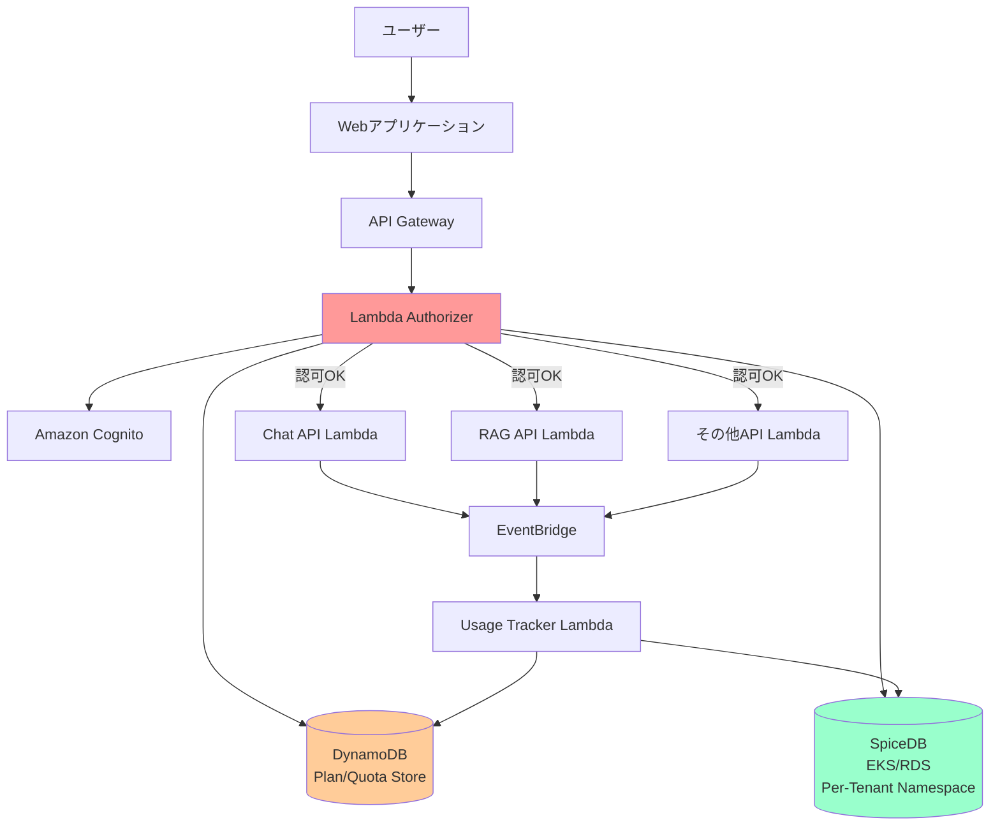
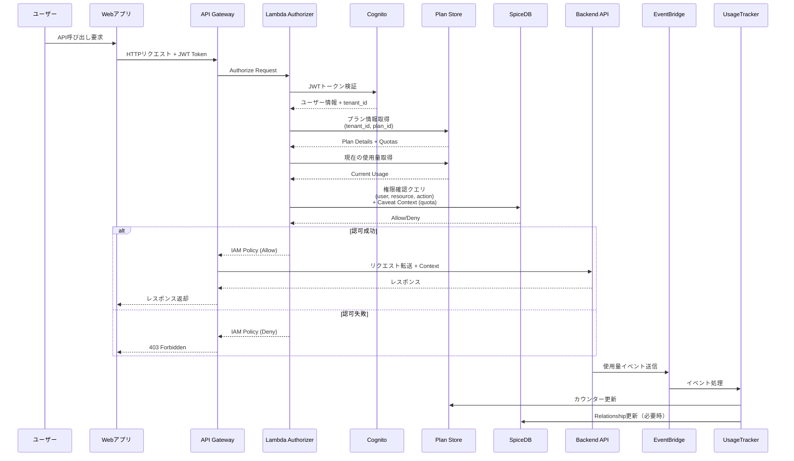

# 認可システム MVP 実装ガイド (SpiceDB)

> **⚠️ マイグレーション完了通知**
>
> **このドキュメントは歴史的資料として保管されています。**
>
> 認可システムは **SpiceDB から OpenFGA に移行が完了**しました。以下のコスト削減と運用効率化を達成しました:
> - **コスト削減**: 70-75% のインフラコスト削減（EKS/RDS → ECS Fargate/RDS）
> - **運用簡素化**: Kubernetes 運用が不要に
> - **機能強化**: ハイブリッド ToC/ToB モデル、Entitlement ベース権限管理
>
> **最新のドキュメントを参照してください:**
> - **[OpenFGA 完全ガイド（英語）](./OPENFGA_COMPLETE_GUIDE.md)** - すべての実装、API、運用情報を含む統合ドキュメント
> - **[OpenFGA 完全ガイド（日本語）](../../ja/OPENFGA_GUIDE_JA.md)** - 日本語での完全なガイド
>
> 以下の内容は SpiceDB での設計資料です。

---

## 概要

本ドキュメントでは、GenU（Generative AI Use Cases）に実装する認可システムのMVP（Minimum Viable Product）について説明します。このシステムは、マルチテナント環境において、ユーザーのリソースアクセスとAPIクォータを制御するための包括的な認可機能を提供します。

### 技術選定: SpiceDB（廃止済み）

> **注意:** SpiceDB 実装は OpenFGA に置き換えられました。

既存のSpiceDB（EKS/RDS）インフラを活用することに決定しました。

**選定理由:**
- ✅ **既存インフラ活用** - 既にEKS/RDSで稼働中、追加デプロイ不要
- ✅ **Caveats機能** - クォータチェックに最適な条件付き権限
- ✅ **運用実績** - Kubernetes Operatorによる自動管理
- ✅ **本番対応** - Zanzibar実装として最も成熟
- ✅ **コスト効率** - 並行システム不要

### 主要な特徴

- **SpiceDB認可システム**: 既存インフラを拡張してテナント別Namespace作成
- **Caveats活用**: クォータと条件付き権限のリアルタイムチェック
- **テナント単位の分離**: 各テナントごとに独立したNamespace
- **きめ細かいアクセス制御**: リソース、ユースケース、モデルレベルでの権限管理
- **プラン/クォータ管理**: サブスクリプションプランに基づいた使用量制限
- **集中型認可チェック**: API Gateway Lambda Authorizerによる統一的な権限検証

## アーキテクチャ

### システム全体図



### 認可フロー詳細



## コンポーネント構成

### 1. Lambda Authorizer

API Gatewayレベルで統合的に認可チェックを実施する中核コンポーネント。

**責務:**
- Cognito JWTトークンの検証
- テナントIDとプラン情報の取得
- 使用量クォータのチェック
- SpiceDBへの権限確認クエリ（Caveat Contextを含む）
- IAM Policyの生成と返却
- メトリクスとログの記録

**実装場所:** `packages/cdk/lambda/authorizer/authorization-authorizer.ts`

### 2. SpiceDB 認可データベース

**デプロイ方法:**
- 既存EKS/RDS構成を活用
- テナントごとに独立したNamespace作成
- Kubernetes Operatorによる自動管理

**特徴:**
- **Caveats機能**: クォータチェックなどの条件付き権限
- **一貫性保証**: ZedToken による厳密な整合性制御
- **高パフォーマンス**: 最適化されたクエリエンジン
- **本番実績**: Googleのサービス含む多数の実績

**Namespace構成:**
```
spicedb-prod/
├── tenant-abc/     # テナント abc の Namespace
│   ├── relationships
│   └── caveats
├── tenant-xyz/     # テナント xyz の Namespace
│   ├── relationships
│   └── caveats
```

### 3. Plan/Quota Store (DynamoDB)

プラン情報、権限設定、使用量カウンターを格納するデータストア。

**テーブル構成:**

#### TenantPlans
```
PK: tenant_id
Attributes:
  - plan_id: string (free/pro/enterprise)
  - plan_name: string
  - stripe_subscription_id: string (将来のStripe連携用)
  - status: string (active/inactive/suspended)
  - start_date: timestamp
  - end_date: timestamp (nullable)
```

#### PlanPermissions
```
PK: plan_id
Attributes:
  - plan_name: string
  - usecases: map<string, boolean>
  - models: map<string, {allowed, daily_quota, monthly_quota}>
  - resources: {max_conversations, max_documents_mb, ...}
  - admin_operations: {invite_user, manage_users, ...}
```

#### TenantUsage
```
PK: tenant_id#resource_type
SK: date#model
Attributes:
  - count: number
  - quota_limit: number
  - last_reset: timestamp
  - ttl: number (自動削除用)
```

GSI:
- `tenant_id-date-index`: 日付別使用量集計用
- `model-index`: モデル別使用量集計用
- `plan_id-date-index`: プラン別分析用

### 4. Usage Tracker Lambda

API呼び出し後にEventBridge経由で使用量を記録し、クォータを更新。

**責務:**
- EventBridgeイベント受信
- DynamoDBカウンターの原子的更新
- クォータ超過検知とアラート
- SpiceDBへのRelationship更新（必要時）

**実装場所:** `packages/cdk/lambda/usage-tracker/track-usage.ts`

## SpiceDB スキーマ設計

### Schema Definition

```spicedb
definition user {}

definition tenant {
    relation member: user
    relation admin: user
    relation subscribed_plan: plan

    permission view = member + admin
    permission manage = admin
}

definition plan {
    relation subscriber: tenant
    relation allowed_usecase: usecase
    relation allowed_model: model

    permission use = subscriber
}

definition conversation {
    relation tenant: tenant
    relation owner: user
    relation viewer: user

    permission view = viewer + owner + tenant->member
    permission edit = owner
    permission delete = owner + tenant->admin
}

definition document {
    relation tenant: tenant
    relation owner: user
    relation viewer: user

    permission view = viewer + owner + tenant->member
    permission upload = tenant->member
    permission delete = owner + tenant->admin
}

definition usecase {
    relation allowed_by_plan: plan

    permission execute = allowed_by_plan->subscriber->member
}

definition model {
    relation allowed_by_plan: plan

    permission execute = allowed_by_plan->subscriber->member
}

// Caveat for quota checking
caveat quota_available(current_usage int, quota_limit int) {
    current_usage < quota_limit
}

// Model with quota caveat
definition model_with_quota {
    relation allowed_by_plan: plan
    relation user: user

    permission execute = (user & allowed_by_plan->subscriber->member) if quota_available
}
```

### Relationships（関係データ）の例

```spicedb
// テナントメンバーシップ
tenant:acme#member@user:alice
tenant:acme#admin@user:bob
tenant:acme#subscribed_plan@plan:pro

// プラン権限
plan:pro#subscriber@tenant:acme
plan:pro#allowed_usecase@usecase:chat
plan:pro#allowed_model@model:claude-3-sonnet

// リソースアクセス
conversation:123#tenant@tenant:acme
conversation:123#owner@user:alice
conversation:123#viewer@user:charlie

// Caveat付きモデル使用権限
model_with_quota:claude-3-sonnet#user@user:alice[quota_available:{"current_usage":8,"quota_limit":50}]
```

## デプロイメント戦略

### 段階的ロールアウト

1. **Phase 1**: 開発環境でSpiceDBスキーマ展開とテスト
2. **Phase 2**: 特定テナントでベータテスト（メトリクス収集）
3. **Phase 3**: 既存テナントのマイグレーション
4. **Phase 4**: 本番環境全体への適用
5. **Phase 5**: Stripe連携追加（将来）

### SpiceDB Namespace作成フロー

```typescript
// 新規テナント作成時
async function createTenantNamespace(tenantId: string) {
  // 1. SpiceDB Namespaceは自動的にRelationship作成時に生成される

  // 2. 初期Relationshipsを作成
  await spiceDBClient.writeRelationships({
    updates: [
      {
        operation: 'OPERATION_CREATE',
        relationship: {
          resource: { objectType: 'tenant', objectId: tenantId },
          relation: 'subscribed_plan',
          subject: { object: { objectType: 'plan', objectId: 'free' } }
        }
      }
    ]
  });

  // 3. Caveat定義はグローバルスキーマに含まれる（テナント固有ではない）
}
```

## 監視とメトリクス

### CloudWatch Metrics

```typescript
{
  Namespace: "Authorization/Authorizer",
  Metrics: [
    "AuthorizationLatency",        // 認可チェック時間
    "AuthorizationDecision",       // Allow/Denyカウント
    "QuotaExceeded",              // クォータ超過回数
    "CacheHitRate",               // キャッシュヒット率
    "SpiceDBLatency",             // SpiceDBレイテンシー
    "CaveatEvaluationTime"        // Caveat評価時間
  ]
}
```

### SpiceDB固有メトリクス

- `spicedb_relationship_count`: Namespace別Relationship数
- `spicedb_check_latency`: 権限チェックレイテンシー
- `spicedb_caveat_evaluation_count`: Caveat評価回数

## セキュリティ考慮事項

### 1. 最小権限の原則

- Lambda AuthorizerはSpiceDBへの読み取りのみ
- 使用量更新Lambda のみDynamoDB書き込み権限
- SpiceDB mTLS認証必須

### 2. Caveat Context検証

- Caveat Contextの改ざん防止
- 使用量データはDynamoDBから直接取得
- Contextは署名検証済み

### 3. データ分離

- テナントごとに独立したNamespace（論理分離）
- クロステナントアクセス防止
- SpiceDB Consistency Tokenによる整合性保証

## トラブルシューティング

### よくある問題と解決策

#### 1. SpiceDB接続タイムアウト

**症状:** Lambda AuthorizerがSpiceDBに接続できない

**原因:**
- VPCセキュリティグループ設定
- SpiceDB Podの再起動

**解決策:**
```bash
# SpiceDB Pod状態確認
kubectl get pods -n spicedb

# Lambda VPCエンドポイント確認
aws ec2 describe-vpc-endpoints --filters "Name=vpc-id,Values=<vpc-id>"
```

#### 2. Caveatクォータチェックが動作しない

**症状:** クォータ超過でもアクセス可能

**原因:**
- Caveat Contextの値が正しくない
- SpiceDBスキーマのCaveat定義エラー

**解決策:**
```bash
# Caveat定義確認
zed schema read

# 権限チェックデバッグ
zed permission check \
  model_with_quota:claude-3-sonnet \
  execute \
  user:alice \
  --caveat-context '{"current_usage":60,"quota_limit":50}' \
  --explain
```

## 次のステップ

最新のOpenFGA実装については、以下のドキュメントを参照してください:
- [OpenFGA 完全ガイド（英語）](./OPENFGA_COMPLETE_GUIDE.md) - すべての実装、API、運用情報を含む統合ドキュメント
- [OpenFGA 完全ガイド（日本語）](../../ja/OPENFGA_GUIDE_JA.md) - 日本語での完全なガイド

## 参考資料

- [SpiceDB公式ドキュメント](https://authzed.com/docs)
- [SpiceDB Caveats](https://authzed.com/docs/spicedb/concepts/caveats)
- [SpiceDB Kubernetes Operator](https://github.com/authzed/spicedb-operator)
- [Google Zanzibar論文](https://research.google/pubs/pub48190/)
- [AWS Lambda Authorizers](https://docs.aws.amazon.com/apigateway/latest/developerguide/apigateway-use-lambda-authorizer.html)
